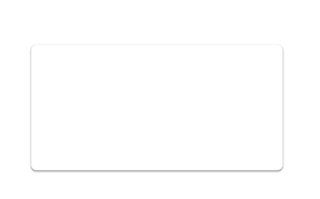

# Titanium.UI.Android.CardView

<TypeHeader/>

## Overview

| Android |
| ------- |
|  |

Use a CardView to layout content that:

  * Comprises multiple data types
  * Does not require direct comparison
  * Supports variable length content or displays more than three lines of text
  * Contains rich content or interactive elements, such as comments or a favorite button

If you are displaying a collection of the same type in a uniform layout without many actions,
use a [ListView](Titanium.UI.ListView) or [TableView](Titanium.UI.TableView) instead.

For design guidelines, see
[Google Design Guidelines: Cards](http://www.google.com/design/spec/components/cards.html)

CardView does not support <Titanium.UI.View.backgroundImage>, <Titanium.UI.View.borderColor>, or <Titanium.UI.View.backgroundGradient>.

## Examples

### Simple Alloy example

``` xml
<Alloy>
    <Window >
        <CardView height="100" width="200">
          <Label text="CardView example"/>
        </CardView>
    </Window>
</Alloy>
```

### CardView used in a ScrollView

The following example creates a CardView used in a ScrollView.

``` js
var win = Ti.UI.createWindow({
    title: 'Card Demo'
});
var scrollView = Ti.UI.createScrollView({
    layout: 'vertical'
});
for (var index = 1; index <= 10; index++) {
    var cardView = Ti.UI.Android.createCardView({
        layout: 'vertical',
        padding: '16dp',
        top: '10dp',
        left: '10dp',
        right: '10dp',
    });
    cardView.add(Ti.UI.createLabel({
        text: 'Card ' + index,
        maxLines: 1,
        font: {
            fontSize: '20dp',
            fontWeight: 'bold'
        },
        width: Ti.UI.FILL
    }));
    cardView.add(Ti.UI.createLabel({
        text: 'This is the card view description text.\nThis is the 2nd line of text.',
        textAlign: Ti.UI.TEXT_ALIGNMENT_LEFT,
        width: Ti.UI.FILL
    }));
    scrollView.add(cardView);
}
win.add(scrollView);
win.open();
```

<ApiDocs/>
