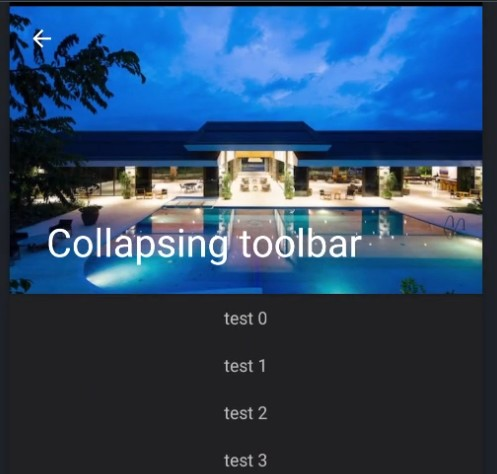

# Titanium.UI.Android.CollapseToolbar

<TypeHeader/>

## Overview

| Android |
| ------- |
|  |

CollapseToolbar acts as a top-level container for window content that allows to set a parallax image and title
in the toolbar. The main content goes into `centerView` and will automatically be scrollable.

## Examples

### Simple setup

The following code shows a simple drawer-layout usage.

``` js
const win = Ti.UI.createWindow({
	theme: "Theme.Titanium.DayNight.NoTitleBar"
});

const centerView = Ti.UI.createView({
	layout: "vertical",
	height: Ti.UI.SIZE
});

for (let i = 0; i < 40; ++i) {
	let lbl = Ti.UI.createLabel({
		text: "test " + i,
		height: 40
	});
	centerView.add(lbl);
}

const collapsingToolbar = Ti.UI.Android.createCollapseToolbar({
	contentScrimColor: "#333",
	top: 0,
	image: "default.png",
	title: "Collapsing toolbar"
});


win.addEventListener('open', function() {
	collapsingToolbar.contentView = centerView;
	collapsingToolbar.onHomeIconItemSelected = function() {
		alert("click click");
	};
	collapsingToolbar.displayHomeAsUp = true;
});

win.add(collapsingToolbar);
win.open();
```

### Alloy example

``` js
<Alloy>
	<Window>

		<CollapseToolbar platform="android">

			<ContentView>
				<View backgroundColor="red" height="Ti.UI.SIZE">
					<Label>test</Label>
				</View>
			</ContentView>
		</CollapseToolbar>

	</Window>
</Alloy>
```

<ApiDocs/>
