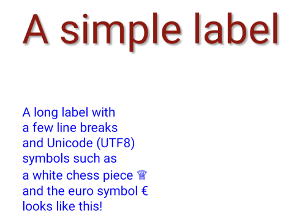

# Titanium.UI.Label

<TypeHeader/>

## Overview

| Android | iOS |
| ------- | --- |
|  |  |

Use the <Titanium.UI.createLabel> method or **`<Label>`** Alloy element to create a label.

## Examples

### Simple Alloy XML Example

Simple label in a Window

``` xml
<Alloy>
    <Window>
        <Label text="Just a label with text"/>
    </Window>
</Alloy>
```

### Basic Label

Create a center-aligned label with a text shadow and specified-size font, and another
containing forced line breaks and Unicode symbols.

``` js
var win = Ti.UI.createWindow({
  backgroundColor: 'white',
  exitOnClose: true,
  fullscreen: false,
  layout: 'vertical',
  title: 'Label Demo'
});

var label1 = Ti.UI.createLabel({
  color: '#900',
  font: { fontSize:48 },
  shadowColor: '#aaa',
  shadowOffset: {x:5, y:5},
  shadowRadius: 3,
  text: 'A simple label',
  textAlign: Ti.UI.TEXT_ALIGNMENT_CENTER,
  top: 30,
  width: Ti.UI.SIZE, height: Ti.UI.SIZE
});

var label2 = Ti.UI.createLabel({
  color:'blue',
  text: 'A long label with\na few line breaks\nand Unicode (UTF8)\nsymbols such as\na white chess piece \u2655\nand the euro symbol \u20ac\nlooks like this!\n',
  textAlign: Ti.UI.TEXT_ALIGNMENT_LEFT,
  top: 30,
  width: 300, height: 200
});

win.add(label1);
win.add(label2);
win.open();
```

### Alloy XML Markup

Previous example as an Alloy view.

The font and shadowOffset properties need to be defined in the TSS or controller file.
These property values are dictionaries, rather than single values,
so they cannot be included in the markup.

``` xml
<Alloy>
    <Window id="win" backgroundColor="white" exitOnClose="true" fullscreen="false" layout="vertical" title="Label Demo">

        <!-- The text property can either be defined as an attribute or as node text. -->
        <Label id="label1" color="#900" shadowColor="#aaa" text="A simple label" textAlign="Ti.UI.TEXT_ALIGNMENT_CENTER"
            top="30" width="Ti.UI.SIZE" height="Ti.UI.SIZE" />
        <Label id="label2" color="blue" textAlign="Ti.UI.TEXT_ALIGNMENT_LEFT" top="30" width="300" height="200">
            A long label with\na few line breaks\nand Unicode (UTF8)\nsymbols such as\na white chess piece \u2655\nand the euro symbol \u20ac\nlooks like this!\n
        </Label>
    </Window>
</Alloy>
```

<ApiDocs/>
