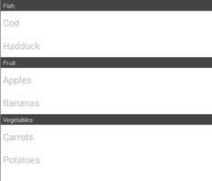
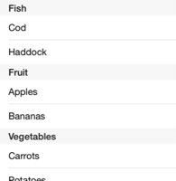

# Titanium.UI.TableView

<TypeHeader/>

## Overview

| Android | iOS | Windows |
| ------- | --- | ------- |
|  |  |  |

A `TableView` object is a container for [TableViewSection](Titanium.UI.TableViewSection)
objects that are, in turn, containers for [TableViewRow](Titanium.UI.TableViewRow) objects.

Use the <Titanium.UI.createTableView> method or **`<TableView>`** Alloy element to create a `TableView`.

Also see the [TableViews guide](https://docs.appcelerator.com/platform/latest/#!/guide/TableViews).

### Creating Tables

There are few approaches to creating and using `TableView` object.

The simplest approach is to pass dictionaries of `TableViewRow` properties, such as
[backgroundColor](Titanium.UI.TableViewRow.backgroundColor),
[color](Titanium.UI.TableViewRow.color), and [title](Titanium.UI.TableViewRow.title), to the
[createTableView](Titanium.UI.createTableView) method, which causes the rows to be implictly
created, added to a single [TableViewSection](Titanium.UI.TableViewSection), and then added to
the `TableView`. Refer to the "Simple Table View with Basic Rows" example.

For more control over the layout of each row, however, [TableViewRow](Titanium.UI.TableViewRow)
objects can be created explicitly using the <Titanium.UI.createTableViewRow> method. Child views,
such as [labels](Titanium.UI.Label), [images](Titanium.UI.ImageView), and
[buttons](Titanium.UI.Button), may be added to each row. When one or more
[rows](Titanium.UI.TableViewRow) are added to the table view,
a single [TableViewSection](Titanium.UI.TableViewSection) is automatically created to hold the
rows. See the "Table View with Composite Layout" example.

Lastly, sets of rows may be explicitly created and added to a their own
[TableViewSection](Titanium.UI.TableViewSection) objects, which are then added to a `TableView`,
to enable the rows to be organized. Headers and footers titles or views must be configured
in order for the sections to be visible.

### Tables and Scroll Views

As a table view inherently scrolls, it creates a very poor user experience when one contains
other scrolling views, such as a [ScrollableView](Titanium.UI.ScrollableView) or
[TextArea](Titanium.UI.TextArea). Thus, this layout is strongly discouraged.

### TextFields in Tables with SOFT_INPUT_ADJUST_PAN (Android)

When a [TextField](Titanium.UI.TextField) is placed in a row near the bottom of a `TableView`,
in a window that is configured with
[SOFT_INPUT_ADJUST_PAN](Titanium.UI.Android.SOFT_INPUT_ADJUST_PAN), it is expected for the
text field to automatically move to a visible position after it is focused and the software
keyboard displayed. However, due to a known problem caused by native Android's ListView behavior,
the keyboard is likely to completely obscure the text field.

To mitigate this, a `ScrollView` may be used instead of a table view, as demonstrated in the
[ScrollView](Titanium.UI.ScrollView), "Scroll View as a Table View", example.

### Known Issues

There are known issues with the `sections` property and associated methods added in
Release 3.0:

*   On iOS, the first two arguments to the `updateSection` method are reversed.
    ([TIMOB-12625](https://jira.appcelerator.org/browse/TIMOB-12625)). This issue has been
    addressed in Release 3.3.0 of the Titanium SDK

### Row Editing and Moving Modes

Table views have an `editing` and a `moving` mode that may be activated to using their
respective [editing](Titanium.UI.TableView.editing) and [moving](Titanium.UI.TableView.moving)
properties. These allow rows to be deleted or re-ordered by the user, depending on each row's
[editable](Titanium.UI.TableViewRow.editable) and [moveable](Titanium.UI.TableViewRow.moveable)
property that are either explicitly set or inherited from the table.

There are two UI controls available for deleting table view rows, depending on the combination
of editing and moving modes enabled:

* "red icon delete" - a circular red icon is displayed on the left-hand side of a row, which
reveals a delete button on the right-hand side of that row when clicked.
* "swipe delete" - without either of the table editing or moving modes enabled, a left or right
swipe gesture on a row reveals a delete button on the right-hand side of the row.

Note that because the operating system handles the functionality of the swipe delete, the OS will
capture swipe events and not bubble the event to Titanium listeners. As such, if you rely on
swipe events, you must not set editing to true on such rows, and simulate the functionality you
need.

When `editable` and `moveable` properties are set on the table view, they are known as `inherited`,
whereas when set on a row, they are known as `explicit`. As their resulting behavior may not
follow their literal meaning, depending on the combination of `editing` and `moving` modes that
are enabled, a detailed description of the behavior follows.

With `editing:false` and `moving:true`:

* For red icon delete and swipe delete, inherited and explicit `editable` properties may be set.
* Inherited `moveable` property is always `true`. Explicit `moveable` property may be set.

With `editing:true` and `moving:false`:

* For red icon delete and swipe delete, inherited `editable` property is always `true`. Explicit
`editable` property may be set.
* Inherited and explicit `moveable` properties may be set.

With `editing:false` and `moving: false`:

* For red icon delete, inherited and explicit `editable` properties always `false`. For
swipe delete, inherited and explicit `editable` properties may be set.
* Inherited `moveable` property is always `false`.

With `editing:true` and `moving:true`:

* For red icon delete and swipe delete, inherited and explicit `editable` properties may be set.
* Inherited `moveable` property is always `true`. Explicit `moveable` property may be set.

## Examples

### Simple Table View

Create a basic table view.

``` js
Ti.UI.backgroundColor = 'white';
var win = Ti.UI.createWindow();

var tableData = [ {title: 'Apples'}, {title: 'Bananas'}, {title: 'Carrots'}, {title: 'Potatoes'} ];

var table = Ti.UI.createTableView({
  data: tableData
});
win.add(table);
win.open();
```

### Table View Sections

Create a table with three sections, each with two rows. Add two sections to the table
before and one after it is rendered. This sample only works on Release 3.0 and later.

``` js
Ti.UI.backgroundColor = 'white';
var win = Ti.UI.createWindow();

var sectionFruit = Ti.UI.createTableViewSection({ headerTitle: 'Fruit' });
sectionFruit.add(Ti.UI.createTableViewRow({ title: 'Apples' }));
sectionFruit.add(Ti.UI.createTableViewRow({ title: 'Bananas' }));

var sectionVeg = Ti.UI.createTableViewSection({ headerTitle: 'Vegetables' });
sectionVeg.add(Ti.UI.createTableViewRow({ title: 'Carrots' }));
sectionVeg.add(Ti.UI.createTableViewRow({ title: 'Potatoes' }));

var table = Ti.UI.createTableView({
  data: [sectionFruit, sectionVeg]
});

win.add(table);
win.open();

var sectionFish = Ti.UI.createTableViewSection({ headerTitle: 'Fish' });
sectionFish.add(Ti.UI.createTableViewRow({ title: 'Cod' }));
sectionFish.add(Ti.UI.createTableViewRow({ title: 'Haddock' }));

// Prior to Release 3.0, you can only add and remove sections by setting the data property
// table.data = [ sectionFish, sectionFruit, sectionVeg ];
// Due to a known issue, TIMOB-12616, the section access methods and sections
// property should not be used on iOS with Release 3.0.x.
table.insertSectionBefore(0, sectionFish);
```

### Table View with Composite Layout

Create a table of rows that contain a custom child-view layout.

``` js
Ti.UI.setBackgroundColor('#000');
var win = Ti.UI.createWindow({
  backgroundColor: 'black',
  exitOnClose: true,
  fullscreen: false,
  title: 'TableView Demo'
});

// generate random number, used to make each row appear distinct for this example
function randomInt(max){
  return Math.floor(Math.random() * max) + 1;
}

var IMG_BASE = 'images/';
var defaultFontSize = Ti.Platform.name === 'android' ? 16 : 14;

var tableData = [];

for (var i=1; i<=20; i++){
  var row = Ti.UI.createTableViewRow({
    className:'forumEvent', // used to improve table performance
    selectedBackgroundColor:'white',
    rowIndex:i, // custom property, useful for determining the row during events
    height:110
  });

  var imageAvatar = Ti.UI.createImageView({
    image: IMG_BASE + 'custom_tableview/user.png',
    left:10, top:5,
    width:50, height:50
  });
  row.add(imageAvatar);

  var labelUserName = Ti.UI.createLabel({
    color:'#576996',
    font:{fontFamily:'Arial', fontSize:defaultFontSize+6, fontWeight:'bold'},
    text:'Fred Smith ' + i,
    left:70, top: 6,
    width:200, height: 30
  });
  row.add(labelUserName);

  var labelDetails = Ti.UI.createLabel({
    color:'#222',
    font:{fontFamily:'Arial', fontSize:defaultFontSize+2, fontWeight:'normal'},
    text:'Replied to post with id ' + randomInt(1000) + '.',
    left:70, top:44,
    width:360
  });
  row.add(labelDetails);

  var imageCalendar = Ti.UI.createImageView({
    image:IMG_BASE + 'custom_tableview/eventsButton.png',
    left:70, bottom: 2,
    width:32, height: 32
  });
  row.add(imageCalendar);

  var labelDate = Ti.UI.createLabel({
    color:'#999',
    font:{fontFamily:'Arial', fontSize:defaultFontSize, fontWeight:'normal'},
    text:'on ' + randomInt(30) + ' Nov 2012',
    left:105, bottom:10,
    width:200, height:20
  });
  row.add(labelDate);

  tableData.push(row);
}

var tableView = Ti.UI.createTableView({
  backgroundColor:'white',
  data:tableData
});

win.add(tableView);
win.open();
```

### Alloy XML Markup

Previous table view sections example as an Alloy view.

``` xml
<Alloy>
    <Window id="win" backgroundColor="white">
        <TableView id="table">
            <TableViewSection id="sectionFruit" headerTitle="Fruit">
                <TableViewRow title="Apple"/>
                <TableViewRow title="Bananas"/>
            </TableViewSection>
            <TableViewSection id="sectionVeg" headerTitle="Vegetables">
                <TableViewRow title="Carrots"/>
                <TableViewRow title="Potatoes"/>
            </TableViewSection>
            <TableViewSection id="sectionFish" headerTitle="Fish">
                <TableViewRow title="Cod"/>
                <TableViewRow title="Haddock"/>
            </TableViewSection>
        </TableView>
    </Window>
</Alloy>
```

<ApiDocs/>
