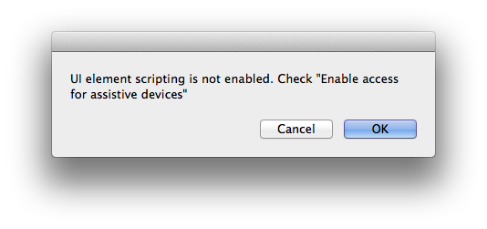
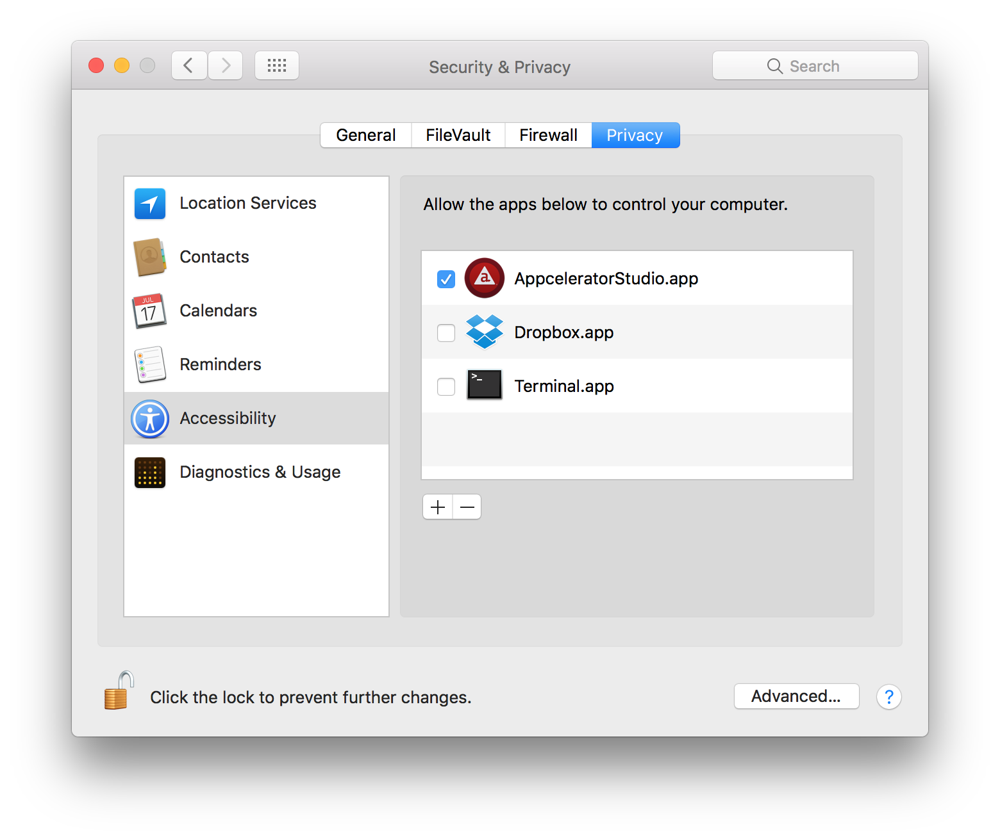

# Installing the iOS SDK

::: warning ⚠️ Warning
Due to Apple's terms and conditions, the iOS SDK may only be installed on Apple products, hence only instructions for installing to Apple's macOS operating system are provided here.
:::

## Overview

This guide describes where to obtain and how to install the Xcode developer tools including the iOS and watchOS SDKs.

## Compatibility and download

Titanium requires Xcode to be installed in order for you to develop iOS applications.


There are two ways to obtain Xcode, the application that installs and manages iOS SDKs:

1. Launch the _App Store_ application, found in the `Applications` folder, and search for and install "Xcode" (includes the stable iOS and watchOS SDKs).

2. Enroll with the Apple Developer website and browse the [iOS Developer Center](https://developer.apple.com/download/) page to manually download the installer application (includes all previously-released iOS SDKs and new Beta versions).

Both of the above options are free of charge, although may require credit card details to be entered. Since 2016, you can also test your apps on your device using the free Apple developer program. If you wish to deploy your applications to the App Store for production, however, you will need to become a member of the _iOS Developer Program_, by way of an annual subscription charge of $99 at the time of writing.

### Xcode

To develop for iOS, Titanium requires Apple's Xcode suite of tools.

Each Titanium SDK supports a specific range of Xcode versions, shown in the table below.

#### Supported versions of Xcode

| Titanium SDK Version | Min Xcode Version | Max Xcode Version | Notes |
| --- | --- | --- | --- |
| 10.1.0 - latest | 11.0.0 | 13.x | Full support for iOS 15 |
| 10.0.0 - 10.0.2 | 11.0.0 | 12.x | Dropped iOS 11 support |
| 9.3.0 - 9.3.2 | 11.0.0 | 12.x |  |
| 9.2.0 - 9.2.2 | 11.0.0 | 12.x | Full support for iOS 14 and beta support for macOS via Mac Catalyst |
| 9.0.0 - 9.1.0 | 9.0.0 | 11.x | Dropped iOS 9 support |
| 8.3.0 - 8.3.1 | 8.0.0 | 11.x |  |
| 8.2.0 - 8.2.1 | 8.0.0 | 11.x | Full support for iOS 13 |
| 8.0.0 - 8.1.1 | 8.0.0 | 10.x |  |

#### Unsupported versions of Xcode

| Titanium SDK Version | Min Xcode Version | Max Xcode Version | Notes |
| --- | --- | --- | --- |
| 7.5.0 - 7.5.2 | 8.0.0 | 10.x |  |
| 7.4.0 - 7.4.2 | 8.0.x | 10.x | Full support for iOS 12 |
| 7.0.0 - 7.3.1 | 6.0.x | 9.0.x |  |
| 6.3.0 | 6.0.x | 9.0.x |  |
| 6.2.x | 6.0.x | 9.0.x | Full support for iOS 11 |
| 5.5.x - 6.1.x | 6.0.x | 8.0.x |  |
| 5.0.0 - 5.4.0 | 6.0.x | 7.0.x |  |
| 4.0.0 - 4.1.x | 6.0.x | 6.4.x |  |
| 3.4.0 - 3.5.x | 6.0.x | 6.0.x |  |

Deploying for iOS 11.x requires Xcode 9.x, and macOS 10.12.4 and later.

Deploying for iOS 12.x requires Xcode 10.x, and macOS 10.13.6 and later.

As per apple guidelines, Starting April 2020 all apps submitted to App Store must be built with iOS 13 SDK or later, included in Xcode 11 or later.

### iOS SDK / Target iOS platform

Each Titanium SDK supports a specific range of iOS base SDKs and deployment targets. To build an application for a specific iOS target version, you must have the appropriate iOS SDK installed.

#### Supported versions of iOS SDK / Target iOS platform

| Titanium SDK version | Minimum iOS SDK version | Maximum iOS SDK version | Minimum target iOS version | Maximum target iOS version |
| --- | --- | --- | --- | --- |
| 10.1.0 - latest | 13.0.0 | 15.x | 12.0 | 15.x |
| 10.0.0 - 10.0.2 | 13.0.0 | 14.x | 12.0 | 14.x |
| 9.2.0 - 9.3.x | 13.0.0 | 14.x | 10.0 | 14.x |
| 9.0.0 - 9.1.2 | 11.0.0 | 13.x | 10.0 | 13.x |
| 8.2.0 - 8.3.1 | 10.0.0 | 13.x | 9.0 | 13.x |
| 8.0.0 - 8.1.1 | 10.0.0 | 12.x | 9.0 | 12.x |

#### Unsupported versions of iOS SDK / Target iOS platform

| Titanium SDK version | Minimum SDK version | Maximum SDK version | Minimum target iOS version | Maximum target iOS version |
| --- | --- | --- | --- | --- |
| 7.4.0 - 7.5.x | 8.0.0 | 12.x | 8.0 | 12.x |
| 7.0.0 - 7.3.x | 8.0.0 | 11.x | 8.0 | 12.x |
| 6.2.0 - 6.3.x | 8.0.x | 11.x | 8.0 | 12.x |
| 6.0.0 - 6.1.x | 8.0.x | 10.x | 8.0 | 12.x |
| 5.5.x | 8.0.x | 10.x | 7.1.x | 9.3.x |
| 5.0.0 - 5.4.x | 8.0.x | 9.3.x | 7.1.x | 9.3.x |
| 4.0.0 - 4.1.x | 8.0.x | 8.4.x | 7.1.x | 8.4.x |
| 3.4.0 - 3.5.x | 8.0.x | 8.0.x | 7.1.x | 8.0.x |
| 3.2.2 - 3.3.0 | 7.0.x | 7.1.x | 6.1.x | 7.1.x |
| 3.1.3 - 3.2.1 | 7.0.x | 7.0.x | 6.1.x | 7.0.x |
| 3.1.1 - 3.1.2 | 5.0.x | 6.1.x | 5.0.x | 6.1.x |
| 3.1.0 | 4.3.x | 6.1.x | 4.3.x | 6.1.x |
| 2.1.3 - 3.0.x | 4.0.x | 6.1.x | 4.0.x | 6.1.x |
| 2.1.0 - 2.1.2 | 4.0.x | 5.1.x | 4.0.x | 5.1.x |
| 2.0.x | 4.0.x | 5.1.x | 4.0.x | 5.1.x |
| 1.8.x | 4.0.x | 5.0.x | 4.0.x | 5.0.x |
| 1.7.1+ | 3.1.2 | 5.0.x | 3.1.2 | 5.0.x |

## Installation (iOS-only)

Note that the typical file system location of this software can be found in the [mac OS Software Locations](/guide/Titanium_SDK/Titanium_SDK_Getting_Started/Installation_and_Configuration/Software_Locations_and_Environment_Variables.html#macos-software-locations) section of these guides.

### Install Xcode

**To install the current version of Xcode**, use the Mac App Store:

1. Launch the **App Store** application from the _Applications_ folder

2. Search for "Xcode"

3. Click the **Free** button, then **Install App** button

The App Store starts the download and installation process.

**To install previous versions of Xcode**, download and run the installer application from [iOS Developer Center: Downloads for Apple Developers](https://developer.apple.com/download/more/).

1. Go to [https://developer.apple.com/download/more/](https://developer.apple.com/download/more/) (Requires an Apple Developer account)

2. Search for "Xcode"

3. Locate the Xcode version you want to install and click the link to start downloading it.

4. Once the download completes, launch the installer application and follow the directions.

### Launch Xcode

To confirm that Xcode has been installed correctly, launch it from _Applications._ When installing Xcode the first time, you are also prompted to accept the End User License Agreement (EULA) and are being asked to installed required components. These will be downloaded once accepted.

### Update Xcode using Xcode installer

When new versions of the SDK are released, launch the _App Store_ and click the **Updates** icon. If Xcode appears, click the **Update** button.

## Install the Command Line tools and previous simulators

The Xcode command-line tools are required for native add-on module development and recommended to be installed for mobile application development. You can either install the command-line tools from Xcode or by running the xcode-select command from a terminal.

To install the command-line tools or older simulator from Xcode:

1. Launch Xcode.

2. Select **Xcode** \> **Preferences.**

3. Select the **Components** icon and click the **Install** button next to the Command Line Tools item.

4. If desired, you can install older simulators.

To install the command-line tools from a terminal, run the following command under "sudo" permissions:

```bash
sudo xcode-select --install
```

## Select the active Xcode version

For systems with multiple Xcode versions installed, the current version can be selected by running `sudo xcode-select` at the command-line.

For example:

```bash
sudo xcode-select -switch /Applications/Xcode.app/Contents/Developer/
```

## Configure the CLI

The CLI use the `xcode-select` command to obtain the location of the Xcode tool to use when building your iOS applications. Neither tool requires any additional configuration.

## Note for Mavericks (and later)

If you are using maxOS 10.9+ and packaging an iOS application to the iTune Stores, after the Xcode Organizer is launched, a dialog from your maxOS may open stating, 'UI element scripting is not enabled. Check "Enable access for assitive devices"'.



This message is misleading as this was the name of the setting in previous versions of macOS, which is already enabled by default on the older versions.

On Mavericks and later, to fix this issue:

1. Open **System Preferences** from the Apple Menu.

2. Click **Security & Privacy**.

3. Click the **Privacy** tab.

4. If the dialog is locked (bottom-left corner), unlock it.

5. Click **Accessibility** from the left list.

6. Enable either **Terminal** (if you are using the CLI).

7. Close the **System Preferences**.


