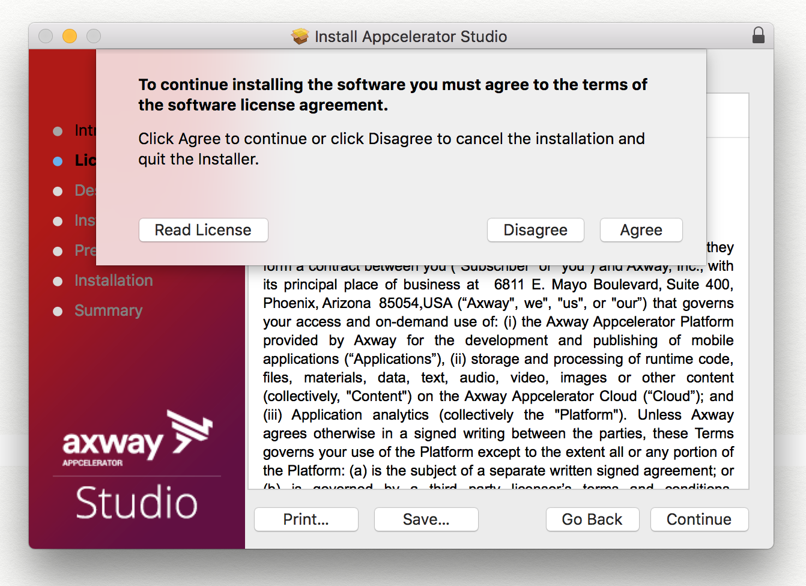
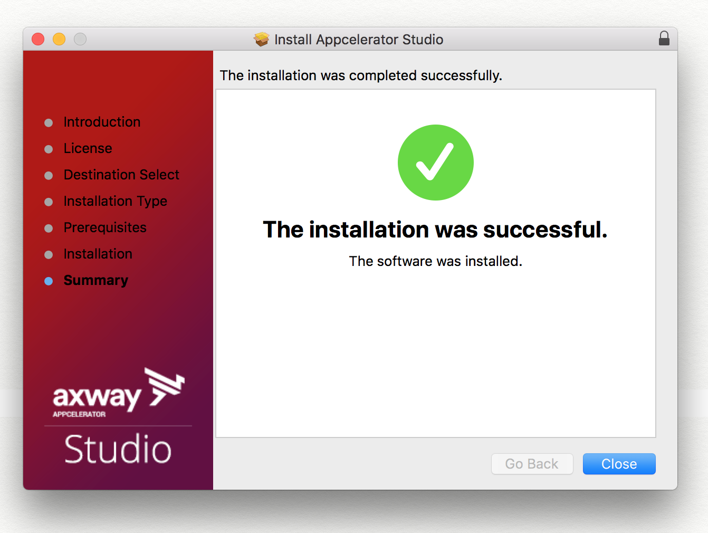
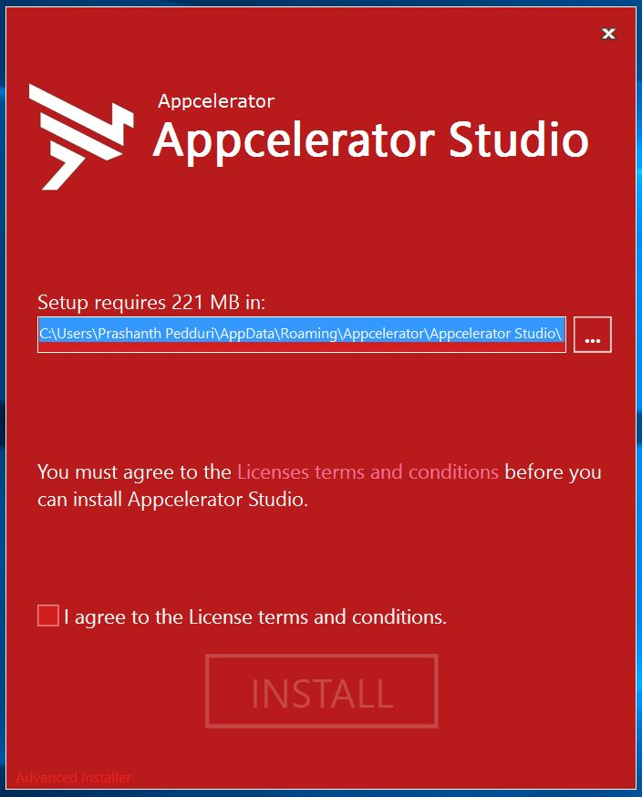
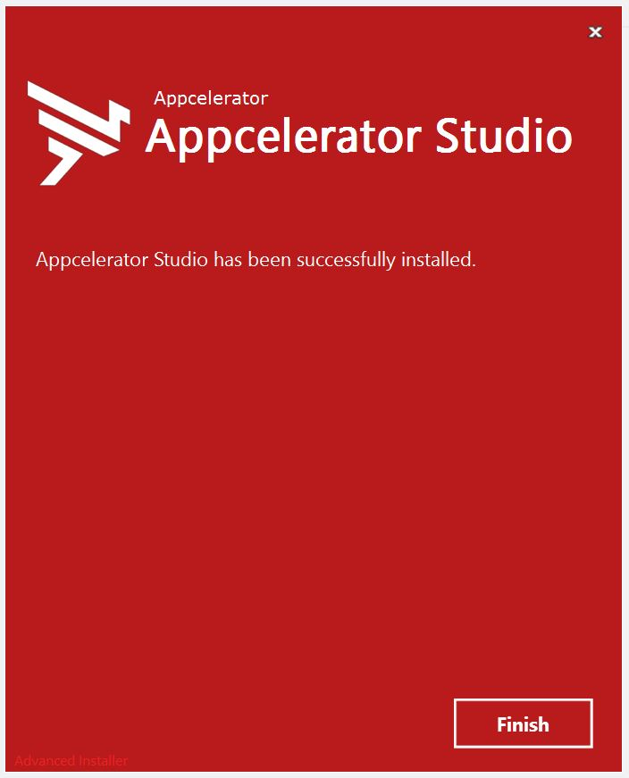

# Setting up Studio

## Getting help overview

This guide walkthroughs the setup of **Axway Appcelerator Studio** (Studio). Although using Studio is not mandatory for mobile application development, which can be done using a text editor and our [command-line tools](/guide/Appcelerator_CLI/), we believe that it is the most effective way to speed up your development process and increase your productivity when building quality applications using Alloy and the Titanium SDK.

## Compatibility and download

Use the latest stable version of Studio.


**[Sign up](http://www.appcelerator.com/signup/)** for an _AMPLIFY Appcelerator Services_ account and **[log in](https://platform.appcelerator.com/#/tools)** to download the installer.

## Preparing for Studio

### System requirements

A system must satisfy the following requirements in order to run Studio.

#### Memory

| Product | Host Operating System | Storage |
| --- | --- | --- |
| Appcelerator Studio | All | 1 GB (contiguous) |
| Latest Android SDK | macOS | 1.5 GB (contiguous) |
| Latest Android SDK | Windows | 1 GB (contiguous) |

::: warning ⚠️ Warning
Minimum system memory requirements is 8GB of RAM. 16GB is highly recommended.
:::

**Please ask your Confluence administrator to update the license for the [MultiExcerpt Plugin for Confluence 4+](https://plugins.atlassian.com/plugins/biz.artemissoftware.confluence.multiexcerpt.MultiExcerptMacro) .**
**Admin Info: The error is: license VERSION\_MISMATCH**

#### Disk space

We recommend the following as a guideline for estimating how much disk space is necessary to build applications using Axway Appcelerator Studio:

| Application | Recommended disk space | Comments |
| --- | --- | --- |
| Xcode | 15 - 20GB | Xcode includes the latest iOS and related simulator(s). |
| Android Studio | 10 - 15GB | You may need to select with SDK(s), NDK(s), and emulators to use. |
| Axway Appcelerator Studio | ~250MB |  |
| Genymotion | ~1GB | Genymotion is optional |
| Mobile app (workspace) | 50MB - 3GB | Disk usage depends on many factors. |

#### Operating system

Titanium is supported on the following Operating Systems:

| Operating System | Version |
| --- | --- |
| macOS | 10.11.5 (Mavericks) and later |
| Windows | Windows 7 and later(Android)  <br />Windows 8.1 and later (Windows Phone)  <br />Windows 10 and later (Windows 10 Mobile) |

::: danger ❗️ Warning
As of Titanium 9.0.0, building Windows apps is no longer supported.
:::
::: danger ❗️ Warning
Support for Windows 8.1 and Windows Phone SDKs has been deprecated as of SDK 6.3.0.GA and has be removed in SDK 7.0.0.GA.
:::

**Please ask your Confluence administrator to update the license for the [MultiExcerpt Plugin for Confluence 4+](https://plugins.atlassian.com/plugins/biz.artemissoftware.confluence.multiexcerpt.MultiExcerptMacro) .**
**Admin Info: The error is: license VERSION\_MISMATCH**

#### Node.js

Titanium SDK has full NodeJS support so users can use NPM modules Android and iOS platforms.

## Minor differences

This implementation includes the NodeJS require algorithm with some minor differences:

* SDK doesn't attempt to load \*.node files

* SDK doesn't have replacements for Node's core modules

* If the required string doesn't have the prefix of `./`, `/`, or `../`, and its not a native module, the SDK will fall back to legacy Titanium behavior of assuming the require is meant as "absolute" inside the app (as in starting at "`Resources/`")

* The SDK will load JSON files and directories (package.json's main property (look at it, resolve it, and try to load it), index.js, and index.json)

## Algorithm summary

To summarize the algorithm the SDK uses, here are three summaries for requiring a module, loading as file, and loading as directory:

### Require(X) from module at path Y

1. If X is a core module,

    1. return the core module

    2. STOP

2. If X begins with ./, or ../,

    1. LOAD\_AS\_FILE(Y + X)

    2. LOAD\_AS\_DIRECTORY(Y + X)

3. If X begins with /,

    1. LOAD\_AS\_FILE(X)

    2. LOAD\_AS\_DIRECTORY(X)

4. If X does not contain '/', assume it should try and load CommonJS module first....

    1. LOAD\_AS\_FILE(X/X.js): try to load "legacy" CommonJS file named `module.id/module.id.js`.

    2. LOAD\_AS\_DIRECTORY(X): try to load CommonJS module as a directory

5. WARN user about possible bad require being treated as absolute THROW "not found"

    1. LOAD\_AS\_FILE(X)

    2. LOAD\_AS\_DIRECTORY(X)

### LOAD\_AS\_FILE(X)

1. If X is a file, load X as JavaScript text or JavaScript Object (JSON). STOP

2. If X.js is a file, load X.js as JavaScript text. STOP

3. If X.json is a file, parse X.json to a JavaScript Object. STOP

### LOAD\_AS\_DIRECTORY(X)

1. If X/package.json is a file, If X/index.js is a file, load X/index.js as JavaScript text. STOP

    1. Parse X/package.json and look for "main" field.

    2. let M = X + (json main field)

    3. LOAD\_AS\_FILE(M)

2. If X/index.json is a file, parse X/index.json to a JavaScript object. STOP

### Software locations

The default and recommended software locations of a successful Titanium installation on each platform are described in [Software Locations and Environment Variables](/guide/Titanium_SDK/Titanium_SDK_Getting_Started/Installation_and_Configuration/Software_Locations_and_Environment_Variables/).

## Installing Studio

The installation procedure for Studio differs depending on the platform.

### OS X

In addition to installing Studio, the installer for OS X also downloads and installs necessary third-party software that it requires, including the Java Development Kit and Node.js.

**To install and run Studio on OS X using the GUI**:

1. Launch the Studio DMG you downloaded.

2. Double-click the PKG file in the dialog.

3. Click **Continue**. The installer will check to see if the perquisites are met.

4. After the check, the license agreement appears. Click **Continue**, then click **Agree** to accept the license agreement.

    
5. Select a destination, typically this will be the **Macintosh HD**, then click **Continue**.

6. Click **Install** to start the installation process. The installer will install the prerequisites and Studio

7. After installation is complete, click **Close** and eject the Appcelerator Studio volume.

    
8. To start Studio, from the Dock, select **Applications** \> **Appcelerator Studio** \> **AppceleratorStudio**.

**To install and run Studio on OS X using the CLI:**

1. Mount the DMG file using the `hdiutil attach` command.

2. Run the installer using the `installer` command with sudo and specify the package and target using the `-pkg` and`-target` options, respectively.

3. Enter your sudo password when prompted. The installer will install the prerequisites and Studio.

4. To start Studio, execute `open /Applications/Appcelerator_Studio/AppceleratorStudio.app/`.

```bash
$ hdiutil attach ~/Downloads/Appcelerator_Studio.dmg
$ sudo installer -pkg "/Volumes/Appcelerator Studio/Appcelerator Studio.pkg" -target "/"
Password:
installer: Package name is Appcelerator Studio
installer: Upgrading at base path /
installer: The upgrade was successful.
```

### Windows

In addition to installing Studio, the installer for Windows also downloads and installs necessary third-party software that it requires to run, including the Java Development Kit, Git, and Node.js.

**To install Studio on Windows using the GUI:**

1. Launch the Studio installer you downloaded. You may be prompted throughout the installation to enter the system's administrator's password.

2. Select the install location. By default, Studio is installed to `%USERPROFILE%\AppData\Roaming\Appcelerator\Appcelerator Studio\` folder.

    ::: warning ⚠️ Warning
    Installing Studio to a common system location (such as `%PROGRAMFILES%)` is not currently recommended as it causes problems during the Studio software update process.
    :::

3. Check the **I agree to the License terms and condition** checkbox.
    

4. Click the **INSTALL** button. The installer determines if the prerequisites are installed. If not, the installer automatically installs them for you.

5. Once the prerequisites are installed, the installer installs Studio. When the installation completes, click **Finish.
    
    **

6. To start Studio, double-click the Studio icon on the Desktop or the Start screen (on Windows 8).

**To install Studio on Windows using the CLI:**

1. Launch the Command Prompt as an administrator. If you do not run as an administrator, the prerequisites will not be installed.

2. Execute the AppceleratorStudio.exe executable with the `/exenoui` and `/q` flags. The installer installs the prerequisites and Studio.

3. To start Studio, execute the `AppceleratorStudio.exe`.

```
C:\Users\JDoe\Downloads>"Appcelerator Studio.exe" /exenoui /q
C:\Users\JDoe\Downloads>cd ..
C:\Users\JDoe>"AppData\Roaming\Appcelerator\Appcelerator Studio\AppceleratorStudio.exe"
```

::: warning ⚠️ Warning
Windows systems must have the following paths at the beginning of their PATH environment variable for Studio to function properly. Most modern Windows systems will already have these paths properly set.

`%SystemRoot%\system32;%SystemRoot%;%SystemRoot%\System32\Wbem;`
:::

## Launching Studio

### Selecting a workspace folder

The first time you launch Studio you need to select a **workspace**, or folder where Studio stores your project files and IDE preferences. By default, Studio prompts you upon each launch to select a workspace.

1. Click **Browse** to select a workspace folder to use.

2. To hide this dialog on subsequent launches, select the **Use this as the default and do not ask again** option.

3. Click **OK**.

::: tip 💡 Hint
To select a different workspace folder at any time:

1. Select **File > Switch Workspace** **\> Other...** to open the Workspace Launcher.

2. Click **Browse...**.

3. Browse to the new workspace folder and click **Open.**

4. Click **OK** in the Workspace Launcher.

To re-enable the the workspace prompt on startup option:

1. Open the Studio Preferences dialog.

2. Select **General > Startup and Shutdown > Workspaces**.

3. Enable the **Prompt for workspace on startup** option.

4. Click **OK**.

5. Restart Studio, which will prompt you for a workspace upon launch.
:::

### Logging in to Studio

On initial launch, Studio asks you to provide your AMPLIFY Appcelerator Services account credentials. Studio requires an internet connection to authenticate the user to the Appcelerator cloud

1. Enter your [AMPLIFY Appcelerator Services](http://www.appcelerator.com/signup/) credentials.

2. Optionally click **Proxy Setup**... to configure your proxy settings if needed.

3. Click **Login.**

Studio remembers your login credentials until you sign out of Studio.

### Checking for Studio and SDK updates

When Studio launches for the first time, it automatically downloads the latest version all Appcelerator components. To confirm that your environment is up-to-date, select **Help > Check for Appcelerator SDK Updates**. This will install the latest versions of the following software:

* Studio

* Titanium SDK

* Node.js

* Required NPM packages

### Installing platform SDKs

To develop native applications with Titanium you need the SDKs and tools for those native platforms installed on your system. For example, to develop Android applications you need the Android SDK and toolchain installed.

The first time you launch Studio the **Platform Configuration** dialog opens. This dialog indicates which platform SDKs are installed and which are not, and lets you easily install individual SDKs. In the following screenshot, the system has none of the native SDKs installed.

**To install the platform SDKs**:

1. Select the platforms you want to install.

2. Optionally click **Settings** next to each platform to customize the installation configuration. For more details, see [Installing Platform SDKs](/guide/Titanium_SDK/Titanium_SDK_Getting_Started/Installation_and_Configuration/Installing_Platform_SDKs/).

3. Click **Configure** to start the installation process.

Studio begins downloading and installing each SDK you selected, according to the settings you specified. In the case of iOS, Studio launches the App Store application installed on your Mac to the XCode download page.


## Configuring advanced platform settings

Typically, you can use the Platform Configuration dialog to download and install mobile SDKs. The **Preferences** dialog to configure advanced settings for the platform SDKs.

**To configure advanced platform settings:**

1. Open the Preferences dialog:

    * On Mac OS X, press **Command key-Comma (,)** or **Appcelerator Studio** \> **Preferences** from the application menu.

    * On Windows, select **Window > Preferences** .

2. Navigate to the **Studio > Platforms** preferences section that contains sections for configuring each mobile platform SDK.

    

The section below describe the settings for each SDK.

### Android settings

Under the **Android** settings item, you can configure the following settings:

* **Android SDK Home** - Location of the Android SDK

* **Android NDK Home** - Location of your Android NDK (only necessary for developing native Titanium module).

* **Default Emulator** - The default Android emulator used to launch your application

    

**To create a new Android emulator or modify an existing one**:

* Click **Manage AVDs...** to open the **Android Virtual Device** **Manage** **r** . See [Managing AVDs with AVD Manager](http://developer.android.com/tools/devices/managing-avds.html) for more information.

**To install additional Android SDKs:**

* Click **Install SDKs...** to open the **Platform Configuration** wizard to install additional Android SDKs.

**To manage Android keystores for distribution:**

* Expand the **Android > Keystores** page where you manage the keystores for packaging APK files for distribution.

* To add an existing keystore, click **Add Existing...** and browse to the keystore file.

* To create a new keystore, click **Create New...** to open the Create Keystore dialog. Enter the keystore information and click **OK** to create the keystore file.

### iOS settings

Under the **iOS** item, you can configure:

* **iOS SDK Home** - indicates the path to Xcode. Use the `xcode-select` command-line tool to change this setting, then restart Studio.

* **Default Device Profile** - select the default simulator to launch your application on.

* Click **Update...** to launch the App Store to update Xcode.

* Click **Refresh** to update the **iOS SDK Home** setting if changed.


#### Managing certificates, provisioning profiles and devices

The iOS settings also includes information about your iOS development certificates, provisioning profiles, and registered devices. It also provides easy access to the Apple Developer Center where you actually create your new certificates, provision profiles and register devices.

The **Certificates** section displays a list of your current certificates.


* To get a new Intermediate Certificate, click **Get Certificate...** to open the Apple Developer Center.

* Click **Refresh** to update the list of certificates if they have changed.

* To get a new developer certificate, click **Get New...** to open the Apple Developer Center in your browser.

The **Provisioning Profiles** section displays a list of provisioning profiles for your development team or organization.


* Click **Refresh** to update the list.

* Click **Browse...** to import a new provisioning profile from your system.

* Click **Get New...** to open the Apple Developer Center in your browser.

The **Devices** section lets you register a device for development. Click **Register Devices...** to open the Apple Deveoper


## Troubleshooting

If you are having problems with any of the above steps, please see our [Installation Troubleshooting](/guide/Titanium_SDK/Titanium_SDK_Getting_Started/Installation_and_Configuration/Installation_Troubleshooting/) guide, or otherwise, seek assistance in either our [Q&A](http://developer.appcelerator.com/questions/created) or one of our other help channels.

## Next steps - verifying Studio

Now that the setup is complete, verify that Studio is configured correctly by importing sample applications and creating new ones as described in [Alloy Samples](/guide/Alloy_Framework/Alloy_How-tos/Alloy_Samples/) or [Example Applications](/guide/Titanium_SDK/Titanium_SDK_Guide/Example_Applications/).
