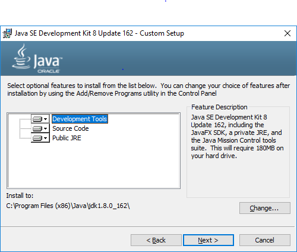
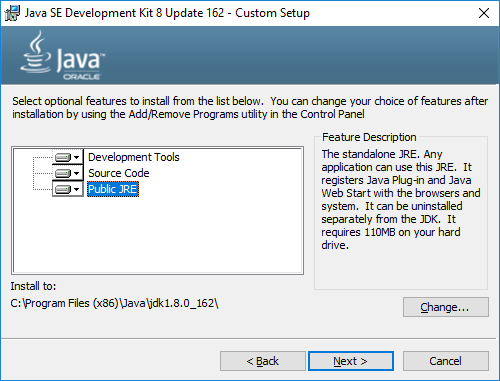
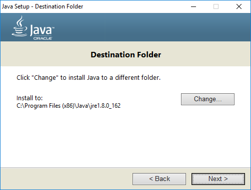

# Installing Oracle JDK

## Compatibility and download

The Java Development Kit (JDK) is required to build Titanium apps and modules for Android.

(Studio also requires the JDK. It's recommended that you use the 64-bit version of JDK 8 with Studio 5.1 or higher.)

| Titanium SDK version | Min JDK version | Max JDK version |
| --- | --- | --- |
| 10.1.0 - latest | 11 | 16 |
| 9.0.2 - 10.0.2 | 8 | 15 |
| 9.0.1 | 8 | 13 |
| 9.0.0 | 8 | 12 |
| 7.5.0 - 8.3.1 | 8 | 14 |
| 7.0.0 - 7.4.2 | 8 | 10 |

 [Download Location](http://www.oracle.com/technetwork/java/javase/downloads/index.html)

## Installation

### OS X

Note that the typical file system location of this software can be found in the [mac OS Software Locations](/guide/Titanium_SDK/Titanium_SDK_Getting_Started/Installation_and_Configuration/Software_Locations_and_Environment_Variables/#macos-software-locations) section of these guides.

Oracle JDK is installed by default on Mac OS X 10.6 (Snow Leopard) and earlier.

On Mac OS X 10.7 and later, the OS should prompt you to install it. You can also go to [Apple Developers](https://developer.apple.com/downloads/) and search 'java' to download the installer.

If you are developing Android applications on your OS X system, you need to install the JDK (Java Development Kit). For details, see [https://support.apple.com/kb/DL1572](https://support.apple.com/kb/DL1572).

### Windows

Note that the typical file system location of this software can be found in the [Windows Software Locations](/guide/Titanium_SDK/Titanium_SDK_Getting_Started/Installation_and_Configuration/Software_Locations_and_Environment_Variables/#windows-software-locations) section of these guides.

* Log in under your usual user account, and right-click the Windows Installer and select _Run as administrator_. Enter the Administrator password, if you are prompted for it, and proceed until the first screenshot below.

* At the **Java SE Development Kit - Custom Setup** > **Install to** step, select the **Development Tools** component and verify that it is in the location suggested in the [Windows Software Locations](/guide/Titanium_SDK/Titanium_SDK_Getting_Started/Installation_and_Configuration/Software_Locations_and_Environment_Variables/#windows-software-locations) section. If not, correct it accordingly. Proceed to the following screenshot below.

* Select the **Public JRE** component and verify that it is in the location suggested in the [Windows Software Locations](/guide/Titanium_SDK/Titanium_SDK_Getting_Started/Installation_and_Configuration/Software_Locations_and_Environment_Variables/#windows-software-locations) section. If not, correct it accordingly.

    

    

* Wait for the JDK installation to complete. The JRE installation will start automatically.

* At the **Java Setup** > **Destination Folder** step, verify that the **Install to** path is the same location suggested in the [Windows Software Locations](/guide/Titanium_SDK/Titanium_SDK_Getting_Started/Installation_and_Configuration/Software_Locations_and_Environment_Variables/#windows-software-locations) section. If not, correct it accordingly.

    

* Complete the installation.

Refer to the [Windows Software Locations](/guide/Titanium_SDK/Titanium_SDK_Getting_Started/Installation_and_Configuration/Software_Locations_and_Environment_Variables/#windows-software-locations) section to add the path to the Oracle JDK `bin` directory to your system's PATH and set the JAVA\_HOME variable.

### Ubuntu

Note that the typical file system location of this software can be found in the [Ubuntu Software Locations](/guide/Titanium_SDK/Titanium_SDK_Getting_Started/Installation_and_Configuration/Software_Locations_and_Environment_Variables/#ubuntu-software-locations) section of these guides.

See the [Software Locations and Environment Variables](/guide/Titanium_SDK/Titanium_SDK_Getting_Started/Installation_and_Configuration/Software_Locations_and_Environment_Variables/) guide if you need help with setting your system `PATH` or other system variables.

To install the Oracle JDK, enable the archive repositories and install the package using the apt-get command:

```bash
sudo add-apt-repository "deb http://archive.canonical.com/ lucid partner"
sudo add-apt-repository "deb http://archive.ubuntu.com/ubuntu hardy main multiverse"
sudo apt-get update
sudo apt-get install oracle-java8-installer
```

If installing the 64-bit JDK, run `sudo apt-get install ia32-libs`.

If you have more than one Java installation, run `sudo update-alternatives --config java` then select `java-8-oracle` as default.

Alternatively, you can download and launch the installation package from Oracle.

## Testing the installation

Run the following commands from the command-line or terminal on any operating system to determine whether JDK has been installed and configured correctly:

```
java -version
javac -version
```

You should receive results similar to the following, where both commands are recognized and return the correct version.

```
Microsoft Windows [Version 10.0.16299.248]
(c) 2017 Microsoft Corporation. All rights reserved.

C:\Users\appcel>java -version
java version "1.8.0_162"
Java(TM) SE Runtime Environment (build 1.8.0_162-b12)
Java HotSpot(TM) Client VM (build 25.162-b12, mixed mode)

C:\Users\appcel>javac -version
javac 1.8.0_162
```
