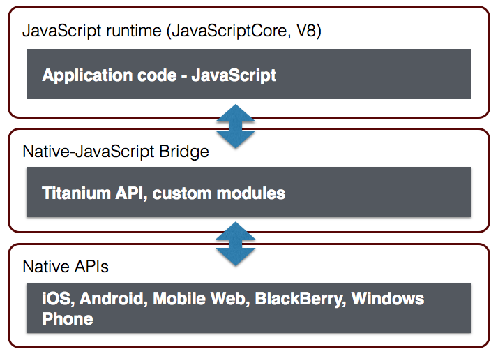

# Titanium Platform Overview

## Objective

Appcelerator Titanium is a free and open source application development platform that lets you create cross platform native mobile applications using existing Javascript skills. In this section, you will examine the Titanium architecture to better understand how you can use it to build native mobile apps.

## Introduction

The Titanium Platform allows you to create, run, and package native mobile applications for iOS and Android devices using our cross-platform JavaScript APIs. Mobile applications built with the Titanium SDK are run against a standalone JavaScript engine which invokes native APIs. As a developer, you are in fact writing a native application–it's just that you're using cross-platform JavaScript rather than non-portable Java or Objective-C.

At a high-level, Titanium is the combination of:

* [Titanium SDK](#titanium-sdk)

* [Titanium CLI](#titanium-cli)

* [Hyperloop](#hyperloop)

* [Alloy](#undefined)

* [Titanium APIs](#titanium-apis)

* [Modules](#undefined)

### Titanium SDK

The [Titanium SDK](/guide/Titanium_SDK/) tools comprise a set of Node.js-based utilities and supporting tools that work with the native SDK tool chains. The Titanium tools combine your JavaScript source code, a JavaScript interpreter, and your static assets into an application binary that will be installed to an emulator or mobile device.

### Titanium CLI

The [Titanium CLI](/guide/Titanium_SDK/Titanium_SDK_Guide/Titanium_Command-Line_Interface_Reference/) is a set of command-line tools to develop and deploy mobile and cloud applications. The Titanium CLI provides a unified interface for using the other Titanium command-line tools, such as the Titanium CLI and Alloy CLI.

### Hyperloop

[Hyperloop](/guide/Titanium_SDK/Titanium_SDK_Guide/Hyperloop/) gives the user 100% direct access to the native APIs. Axway Titanium SDK already covers plenty of the native APIs and makes them cross-platform addressing the most popular APIs. However, Hyperloop enables developers who require access to even the most obscure APIs out there by providing direct access to every Native API.

### Alloy

[Alloy](/guide/Alloy_Framework/) is a framework that allows the development of Axway Titanium SDK mobile application using a Model-View-Controller (or MVC) pattern.

### Titanium APIs

The [Titanium API](#!/api) is a JavaScript-based API that gives you access to hundreds of native UI and non-visual components within your application. These APIs are split into various namespaces such as Titanium.UI (for User Interface) or Titanium.Network (for networking). This set of tutorials will take you through dozens of the most important APIs in the ecosystem.

### Modules

Titanium is built as a series of modules that extend a few core functions of the API. If you check out our [API docs](#!/api), you'll find a list of the base modules included with Titanium. Yes, all those APIs are in fact modules that extend the core. Additionally, TiDev publishes a sampling of free add-on modules that extend this base on our [Github repository](https://github.com/tidev/). Developers are free to extend Titanium themselves by writing their own [iOS](/guide/Titanium_SDK/Titanium_SDK_How-tos/Extending_Titanium_Mobile/iOS_Module_Development_Guide/) and [Android](/guide/Titanium_SDK/Titanium_SDK_How-tos/Extending_Titanium_Mobile/Android_Module_Development_Guide/) modules. Mobile Web even supports modules, though they must be "pure JavaScript" modules rather than being written in Objective-C or Java.

## Titanium at 10,000 feet

Titanium exists as a bridge between the native operating system and your app's code. The following graphic illustrates this architecture:

At the bottom of the stack is the client operating system: Android, iOS, or the browser (for Mobile Web applications). At the top is your app, built JavaScript. In between, is the Titanium SDK and the APIs it exposes. You write your app in JavaScript, calling on the Titanium APIs to take actions like drawing buttons, opening windows, showing the camera, etc. The Titanium bridge (part of the SDK) translates those calls into their native equivalents. In other words, when you create a Titanium button, it's actually a proxy for a true native button. When you modify the Titanium button, say to change its label or add an event listener, Kroll applies corresponding changes to the native equivalent. When events occur in native-land, Kroll bubbles them up to your JavaScript code.

### Going Native

The goal of Titanium is to help developers leverage their Javascript skills to build native mobile apps that run across multiple platforms. It gives you the tools to build apps that look, feel, and perform native. Furthermore, Titanium apps fit well within the native ecosystem of each platform.

Titanium lets you create iOS apps that feel like iOS apps. You have access to all the great Cocoa UI controls: buttons, tables, navigation groups, segmented controls, and more. Titanium exposes a large selection of native animations and transitions, and lets you easily define your own matrix-based transformations. Your app can launch background services or set app and tab badges. And naturally, you can publish apps meeting Apple's guidelines to the iTunes App Store.

In the same way, Titanium also lets you create Android apps that feel like Android apps. You can define menus and handle the hardware buttons. You can start Activities and launch or receive Intents. You can put status messages in Android's Notification bar. And when you're ready, you can publish your app in the Google Play, Amazon Market, AppBrain, and elsewhere.

## References and Further Reading

Throughout the remainder of this book, we'll work under the assumption that you've installed Titanium and its required components. If you need further information or help installing Titanium, please visit our [Titanium SDK Getting Started](/guide/Titanium_SDK/Titanium_SDK_Getting_Started/) wiki page.
