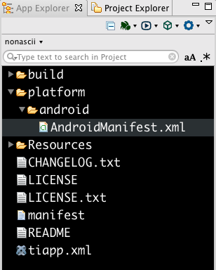

# Maintaining a Custom AndroidManifest.xml

## Contents

## Overview

For the most part, if you have to add properties to the `AndroidManifest.xml` file, you can simply add them to the application's `tiapp.xml` file. If you encounter a setting that you can't override in `tiapp.xml`, you can create a custom `AndroidManifest.xml` file.

## How it works

When you create a new mobile application, you will now see an "android" section inside `tiapp.xml`. When empty, it just looks like this:

```xml
<android xmlns:android="http://schemas.android.com/apk/res/android">
</android>
```

Note we've included the official Android namespace qualifier, and the reason for that is because we wanted the ability to take things out of this section and plop them right into the `AndroidManifest.xml` for you. To that end, things that you put inside of a "manifest" sub-element will be put into your android manifest for you at build time. See [tiapp.xml and timodule.xml Reference](/guide/Titanium_SDK/Titanium_SDK_Guide/Appendices/tiapp.xml_and_timodule.xml_Reference/) for details on elements that you can put in the `tiapp.xml` file.

### Custom Manifest Entries in tiapp.xml

For the most part, if you add a manifest entry to the `tiapp.xml` file, it replaces the entry in the generated file. Consider the following section of a tiapp.xml file:

```xml
<android xmlns:android="http://schemas.android.com/apk/res/android">
    <manifest>
        <uses-sdk android:minSdkVersion="14" />
        <supports-screens
            android:smallScreens="false"
            android:normalScreens="true"
            android:largeScreens="true"
            android:xlargeScreens="false"
        />
    </manifest>
</android>
```

Most elements inside the `<manifest>` will be added as children to the `<manifest>` element inside of `AndroidManifest.xml` at build time, with some intelligence built in. The `<supports-screen>` tag in your tiapp.xml replaces the default `<supports-screen>` tag.

The manifest's all-important [<application>](http://developer.android.com/guide/topics/manifest/application-element.html) element is handled differently. Your elements are applied additively, rather than replacing the **whole** `<application>` element.

For example, let's say you want the `debuggable` attribute of `<application>` to be set to `true` (it's false in the default manifest template), you can do this:

```xml
<android xmlns:android="http://schemas.android.com/apk/res/android">
    <manifest>
        <application android:debuggable="true" />
    </manifest>
</android>
```

The official [Android Developers](http://developer.android.com/guide/topics/manifest/manifest-intro.html) website describes all the other elements that are supported, such as `<service>`, `<uses-permission>` and `<activity>` for instance, and these will be added using the same logic.

## Using a Custom Manifest

In rare circumstances, you may still need to create a custom `AndroidManifest.xml`. If this is the case, be aware of the following advice:

* Name the custom manifest file `AndroidManifest.xml`, and put it in the directory `platform/android` beneath your application's root project directory.

    Create the platform directory if you need to, ensuring that the directory is a sibling of the "Resources" directory, (right below your project root).

    

* If you do have a custom manifest, generates a file named `AndroidManifest.xml.gen` in the `build/android` directory during each build. You can use this to see the `AndroidManifest.xml` that would be generated by default.
