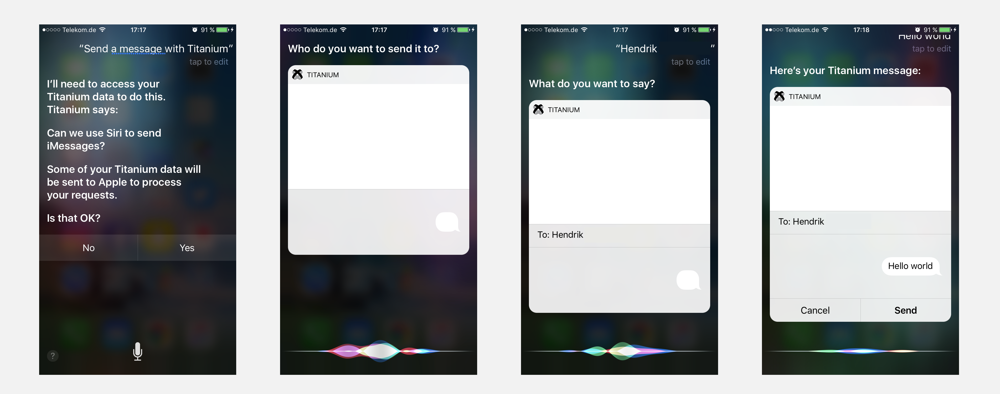
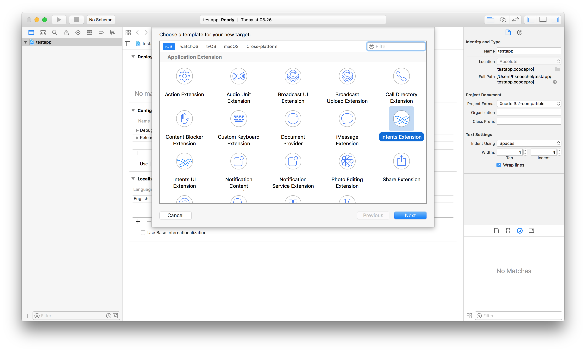
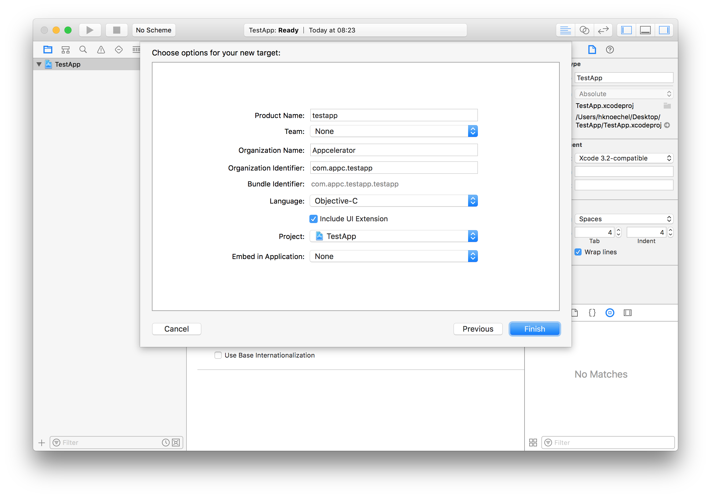
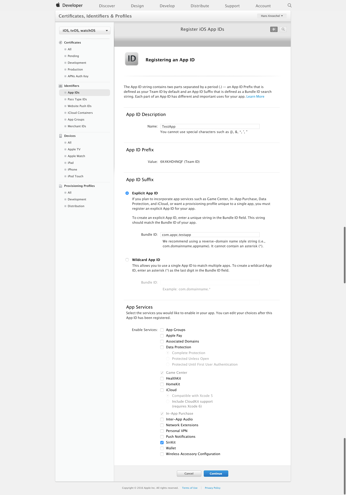

# Creating iOS Extensions - Siri Intents

This following tutorial will guide you through the process of creating a new iOS extension and in this case also shows you how to configure your app to communicate with Siri using the [Intents framework](https://developer.apple.com/reference/intents). This framework is different to some other extensions as it requires special capabilities, provisioning profiles, and privacy-permissions. This document will show you how to do that as well.

The repository for this tutorial can be found open-source on **[Github](https://github.com/appcelerator-developer-relations/ios-extensions-sample-sirikit)** .



## Step-by-step guide

1. Create a native Titanium App with `ti create -p ios,` or use your existing project.

2. The name of the example is TestApp, the `<id>` in tiapp.xml will be something like `com.appc.testapp` .

3. Open Xcode and create new project: `File/New Project/Other/Empty`

4. Name it `TestApp` for this tutorial.

5. Use `File/New/Target/Application Extension/Intents Extension` to create the extension target. By default, Xcode will add some demo code to handle Message Intents, but you can implement whatever Intent extension you want here.

    
6. Name the extension `testapp` and change the "Organization Identifier" to `com.appc.testapp` so that the "Bundle Identifier" is `com.appc.testapp.testapp` - You can also suffix it to something like `siriextension`, but let's keeps it simple for now.

    
7. If you wish, you can activate scheme when prompted, but it doesn't matter because we won't need to open the standalone Xcode-project while building.

8. Create a folder called `extensions` in the Titanium project (root) folder and copy the Xcode extension project into it.

9. In the `tiapp.xml`, include the following properties in the `<ios>` section of it:

    **tiapp.xml**

    ```xml
    <extensions>
        <extension projectPath="extensions/TestApp/TestApp.xcodeproj">
            <target name="testapp"> <!-- or "siriextension" if you name the target differently -->
                <provisioning-profiles>
                    <device>INSERT YOUR EXTENSION PROVISIONING PROFILE ID HERE</device>
                    <dist-appstore/>
                    <dist-adhoc/>
                </provisioning-profiles>
            </target>
        </extension>
    </extensions>
    ```

10. Create or edit your App-ID in the [iOS Developer Center](https://developer.apple.com/account/ios/identifier/bundle) to include the "SiriKit" capability, just like you would do with "Access Groups" or "Push Notifications" for other platform-services. Create one app with a wildcard identifier and one without (e.g. `com.appc.testapp.*` and `com.appc.testapp`). The first one is linked in the `<provisioning-profiles>` section of the target, the latter one is used to build the main target (your app) to the device. Note that SiriKit is supported in the Simulator by Apple, because it doesn't support Siri so far (Status: iOS 10 / November 2016).

    
11. Generate two provisioning profiles (one for your main app and one for the Siri target) in the "[Provisioning Profiles](https://developer.apple.com/account/ios/profile/limited)" section.

12. Add the following to the plist-section of your `tiapp.xml` (`<tiapp>` > `<ios>` > `<plist>`):

    **tiapp.xml**

    ```xml
    <key>NSSiriUsageDescription</key>
    <string>Can we use Siri to do great stuff?</string>
    ```

13. Create a file called `TestApp.entitlements` in your Titanium project root. Note: if you also use push-entitlements, copy those keys over there as well since it will override the CLI-generated key and paste the following into it:

    **TestApp.entitlements**

    ```xml
    <?xml version="1.0" encoding="UTF-8"?>
    <!DOCTYPE plist PUBLIC "-//Apple//DTD PLIST 1.0//EN" "http://www.apple.com/DTDs/PropertyList-1.0.dtd">
    <plist version="1.0">
    <dict>
        <key>com.apple.developer.siri</key>
        <true/>
    </dict>
    </plist>
    ```

14. You made it!! Use `ti build -p ios -T device` to run your app on the device. Remember that iOS currently does not support Siri on the Simulator.

15. You can test the changes by talking to Siri:

    > Send a Message with TestApp

It will know that your app uses the Intent Extension for handling messages and will ask you for Siri permissions by displaying the message you specified in your plist. You can also change the UI of the Intent by changing the storyboard in your "testappUI" target or specify multiple intents. Just create another target and link it the same way as we did above.

And finally, use [Hyperloop](https://www.appcelerator.com/mobile-app-development-products/hyperloop/) or a [native module](/guide/Titanium_SDK/Titanium_SDK_How-tos/Extending_Titanium_Mobile/iOS_Module_Development_Guide/iOS_Module_Quick_Start/) to handle the Intent's responses. Since there dozens of classes and delegates to implement here, you should look for the ones your Intent uses and it will be notified by your extension. This guide may be updated with some samples for that as well, but you can also check some of the existing guides for that:

* [https://developer.apple.com/library/content/documentation/Intents/Conceptual/SiriIntegrationGuide/SiriDomains.html#//apple\_ref/doc/uid/TP40016875-CH9-SW11](https://developer.apple.com/library/content/documentation/Intents/Conceptual/SiriIntegrationGuide/SiriDomains.html#//apple_ref/doc/uid/TP40016875-CH9-SW11)

* [http://jamesonquave.com/blog/adding-siri-to-ios-10-apps-in-swift-tutorial/](http://jamesonquave.com/blog/adding-siri-to-ios-10-apps-in-swift-tutorial/)

* [http://willowtreeapps.com/blog/a-deeper-look-at-sirikit-for-ios-10/](http://willowtreeapps.com/blog/a-deeper-look-at-sirikit-for-ios-10/)

Code strong!
