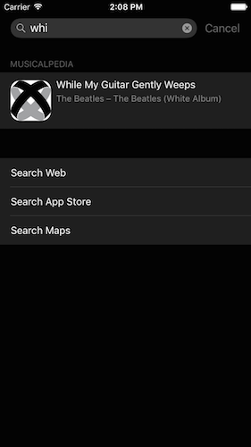
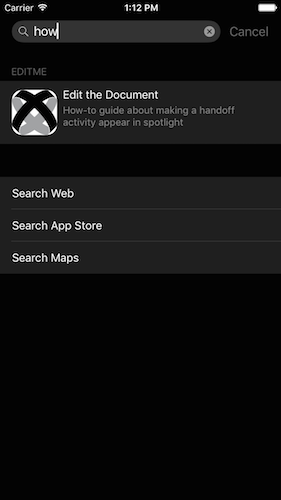

# Spotlight Search

## Introduction

Starting with iOS 9.0, Apple lets you index your application content and activities to be used by the spotlight search in iOS. When a user searches for keywords you indexed, your application or activity will be displayed in the results of the search.

To add a search index of your application for iOS, the Titanium SDK exposes the following APIs:

* [Titanium.App.iOS.SearchableItemAttributeSet](#!/api/Titanium.App.iOS.SearchableItemAttributeSet): define keywords and properties to describe the item you want to index. Note that this object can be added to either a SearchableItem object or an UserActivity object to index application content or activities, respectively.

* [Titanium.App.iOS.SearchableItem](#!/api/Titanium.App.iOS.SearchableItem): assembles the SearchableItemAttributeSet as an unique object package to be indexed.

* [Titanium.App.iOS.SearchableIndex](#!/api/Titanium.App.iOS.SearchableIndex): exposes the iOS search index to add the SearchableItems to the index.

In addition to the APIs exposed by the Titanium SDK, if some of your content is available as web content, you can add special markup to make it discoverable by Apple.

### Private vs. public indexing

You have the option of adding searchable content to either a private index (on-device index) or a public index (Apple's server-side index). The private index will make the searchable content only available on the user's device. The public index makes content available to other users. Only user activities and web content may be added to the public index.

To make content available for public indexing, you need to set the `eligibleForPublicIndexing` property of a UserActivity object to true and add specific mark up notation to your web site to allow Apple to index it.

## Index application content

To index application content:

1. Create a SearchableItemAttributeSet object and define the keywords and properties to describe the item to index.

2. Create a SearchableItem object and set its `attributeSet` property to the previously created SearchItemAttributeSet object.

3. Create an instance of a SearchableIndex and pass the SearchableItem object to the `AddToDefaultSearchableIndex()` method.

To create a SearchableItemAttributeSet object, use the `Titanium.App.iOS.createSearchableItemAttributeSet()` method and pass the method a dictionary with the `itemContentType` attribute set to a [uniform type identifier](https://developer.apple.com/library/ios/documentation/Miscellaneous/Reference/UTIRef/Articles/System-DeclaredUniformTypeIdentifiers.html). You must set this property when creating the object. Use either the `Titanium.App.iOS.UTTYPE_*` constants or the string indentifier. The property describes the content type of the item you will be indexing, for example, an image (`public.image`), movie (`public.movie`) or PDF (`com.adobe.pdf`).

Besides the `itemContentType` property, set other document-specific properties to describe the content to be indexed. For example, the code below describes an item for an audio file.

```javascript
var itemAttr = Ti.App.iOS.createSearchableItemAttributeSet({
    itemContentType: Ti.App.iOS.UTTYPE_AUDIO,
    title: 'While My Guitar Gently Weeps',
    artist: 'The Beatles',
    album: 'The Beatles (White Album)',
    musicalGenre: 'Rock',
    keywords: ['love', 'sleeping', 'floor', 'sweeping']
});
```

To create a SearchableItem object, use the `Titanium.App.iOS.createSearchableItem()` method. Pass the method a dictionary with the following properites defined. Only the `attributeSet` property is required to be set.

* `attributeSet:` set to the previously created SearchableItemAttributeSet object to associate the metadata with the SearchItem object.

* `domainIdentifier:` user-defined string that identifies the domain or owner the item belongs to, for example, if the item describes a song, the domain identifier could be an album.

* `expirationDate:` set to have the content removed by that date. By default, the indexed data will be removed after one month.

* `uniqueIdentifier:` user-defined string that uniquely identifiers the object within the application.

```javascript
var item = Ti.App.iOS.createSearchableItem({
    identifier: 'beatles-white-album-lp-1-track-7',
    domainIdentifier: 'beatles-white-album',
    attributeSet: itemAttr
});
```

To index the item, create an instance of a SearchableIndex with the `Titanium.App.iOS.createSearchableIndex()` method. Invoke the `addToDefaultSearchAbleIndex()` method on the instance, and pass the method an array of SearchableItem objects to index and a callback function to handle the success and error cases.

```javascript
var indexer = Ti.App.iOS.createSearchableIndex();
indexer.addToDefaultSearchableIndex([item], function(e) {
    if (e.success) {
        alert('Press the home button and now search for your keywords');
    } else {
        alert('Error: ' + JSON.stringify(e.error));
    }
});
```

When you run the above code, after the success dialog appears, close the application and go to Spotlight search by swiping to the right on the home screen. Searching for any of the terms from the attribute set will display the item and application as a result.



## Index activities

To index an activity:

1. Create a SearchableItemAttributeSet object and define the keywords and properties to describe the activity to index.

2. Create the UserActivity and set its `eligibleForSearch` property to true, which gives the activity permission to be added to the on-device index.

3. Optional. To make the activity searchable to other users, you need to set the `eligibleForPublicIndexing` property to `true`, and set either the `webpageURL` or `requiredUserInfoKeys` property. The activity will be added to Apple's server-side index.

4. Invoke the UserActivity object's `addContentAttributeSet()` and pass it the SearchableItemAttributeSet object, which adds the attribute set to the device's index and optionally Apple's server-side index.

For example, if the user activity is editing a document, you may want to advertise the activity to spotlight.

```javascript
var itemAttr = Ti.App.iOS.createSearchableItemAttributeSet({
    itemContentType: 'com.microsoft.word.doc',
    title: 'How to Make Activities Searchable',
    contentDescription: 'How-to guide about making a handoff activity appear in spotlight',
    editors: ['user@foo.com', 'editor@apple.com'],
    keywords:['titanium', 'activity', 'handoff', 'spotlight']
});

var activity = Ti.App.iOS.createUserActivity({
    activityType: 'com.foo.edit.docx',
    title:'Edit the Document',
    userInfo:{
        filename: 'howto.docx'
    },
    eligibleForSearch: true
});
activity.addContentAttributeSet(itemAttr);
activity.becomeCurrent();
```



## Respond to an application launch from Spotlight

To know if the application was launched from Spotlight, monitor the [`continueactivity`](#!/api/Titanium.App.iOS-event-continueactivity) event of the `Ti.App.iOS` module. Note that the event is also fired when an activity is handed off to another device.

The event will be passed an object with the following properties:

* `activityType`: Will be set to `com.apple.corespotlightitem` if the application was launched from Spotlight, else it will be a user activity type

* `searchableItemActivityIdentifier`: Will be set to the unique identifier of the search item

* `title`: Title of the item if available

To respond to a launch from Spotlight, check to see if the `activityType` is set to `com.apple.corespotlightitem`, then use the `searchableItemActivityIdentifier` to navigate to the item.

```javascript
Ti.App.iOS.addEventListener('continueactivity', function(e) {

    // Not launched from Spotlight
    if (e.activityType !== 'com.apple.corespotlightitem') {
        return
    }

    var uniqueIdentifier = e.searchableItemActivityIdentifier;

    // Navigate to the content
});
```

## Mark up web content

In order to make web content searchable by Apple, Apple will use the URLs you provide when submitting your application to the iTunes App Store. You will need to update the websites `robots.txt` file to tell Applebot which websites to crawl.

In your website HTML, add [schema.org markup](http://schema.org/docs/schemas.html) and [Open Graph attributes](http://ogp.me/) to make the search results of your web content more rich. Note that Apple only supports a subset of the available schema.org markup. For more details, see [iOS Developer Library: App Search Programming Guide - Mark Up Web Content](https://developer.apple.com/library/prerelease/ios/documentation/General/Conceptual/AppSearch/WebContent.html#//apple_ref/doc/uid/TP40016308-CH8-SW1).

Apple also recommends using universal links, which are links in your web content that opens your application if it is installed on the user's device. For more details, see [iOS Developer Library: App Search Programming Guide - Support Universal Links](https://developer.apple.com/library/prerelease/ios/documentation/General/Conceptual/AppSearch/UniversalLinks.html#//apple_ref/doc/uid/TP40016308-CH12-SW1).

To test your website with the iOS 9 search APIs, use the following URL: [https://search.developer.apple.com/appsearch-validation-tool](https://search.developer.apple.com/appsearch-validation-tool)

## Further reading

* [iOS Developer Library: App Search Programming Guide](https://developer.apple.com/library/prerelease/ios/documentation/General/Conceptual/AppSearch/)
