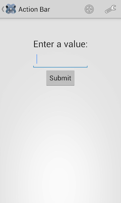
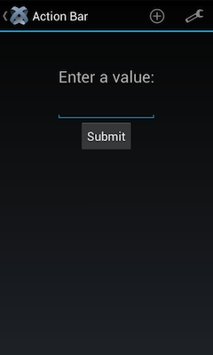
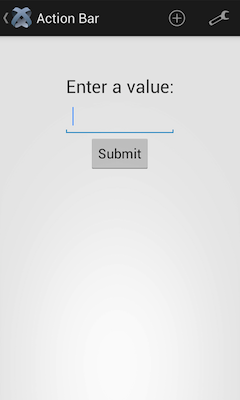
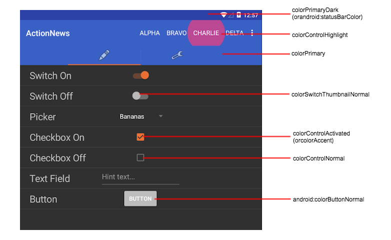
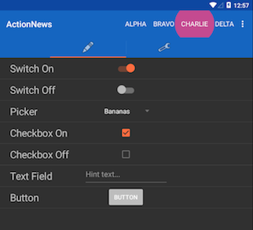
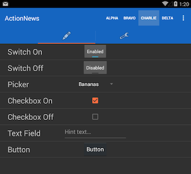
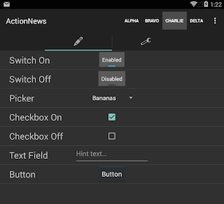

# Android Themes

## Introduction

Android allows you to set the appearance of your application using themes. A theme specifies default colors, fonts, and images, for an Android activity or an entire application. Your application can use the device's built-in themes, or include custom themes. Titanium's root splash screen activity uses `"Theme.Titanium"` by default. All other activity windows will use `"Theme.MaterialComponents.*" derived theme` as of Titanium 9.3.0. Older Titanium versions will use "Theme.AppCompat" for all activity windows.

To update the look of your application, you can either:

* Use a different built-in Android theme

* Use a Titanium-defined theme

* Create a custom theme and define the elements you want to change

* Use the Android Material Theme to quickly customize the theme's color palette

* Use third-party tools to help you generate a custom theme

You can also assign a unique theme to an activity instead which would override the application's assigned theme.

## Android AppCompat themes

::: danger ❗️ Warning
As of Titanium 10.0.0, AppCompat themes are no longer supported. Using them will cause a runtime error occur. This is because Titanium 10.0.0 uses native material widgets/views that require MaterialComponents based themes to work.
:::

Android provides some built-in themes to easily change the overall appearance of your application. To use a built-in theme, you need to create a theme XML file for your project, specify the built-in theme you want to use, and reference it in the Android manifest section of your `tiapp.xml` file.

First, create a theme XML file in `./platform/android/res/values`. For Titanium SDK 8.x.x and older, do **NOT** name the file `theme.xml` since it will overwrite Titanium's built-in `theme.xml` file. This is not an issue with Titanium 9.0.0 and higher.

In the theme XML file, add the theme you want to use. Themes defined by the Android system, excluding the AppCompat ones, are prefaced with @android:style (for example, @android:style/Theme.Translucent). Custom themes defined by the application are prefaced with @style (for example, @style/Theme.MyTheme). For example, the file below adds support for some of the common built-in Android themes.

**platform/android/res/values/builtin\_themes.xml**

```xml
<?xml version="1.0" encoding="utf-8"?>
<resources xmlns:android="http://schemas.android.com/apk/res/android">
  <style name="LightDarkBar" parent="Theme.AppCompat.Light.DarkActionBar"/>
  <style name="Light" parent="Theme.AppCompat.Light"/>
  <style name="Dark" parent="Theme.AppCompat"/>
</resources>
```

Finally, to use a theme in your application, modify the Android section of your `tiapp.xml` file to reference the style name you want to use:

```xml
<android xmlns:android="http://schemas.android.com/apk/res/android">
    <manifest>
        <application android:theme="@style/LightDarkBar"/>
    </manifest>
</android>
```

The screenshots below show the difference between the various built-in themes:

| AppCompat.Light | AppCompat/Holo | AppCompat.Light.DarkActionBar |
| --- | --- | --- |
|  |  |  |

## Titanium material themes

As of Titanium 10.0.0, all of the below are material based themes which support displaying Google's native material widgets/views. You can apply these themes to your application or individual activities instead of creating your own custom theme.

| Theme Name | SDK Version | Description |
| --- | --- | --- |
| Theme.Titanium | 1.0.0 | Theme applied to the root splash screen activity only. Does not show a top action bar. As of 10.0.0, the top status bar and bottom navigation bar are translucent.<br /><br />This splash theme inherits from a material theme as of Titanium 9.3.0. |
| Theme.Titanium.DayNight | 10.0.0 | Supports light/dark material theme switching. Shows an action bar and status bar.<br /><br />This is the default application theme as of Titanium 10.0.0. |
| Theme.Titanium.DayNight.NoTitleBar | 10.0.0 | Supports light/dark material theme switching without an action bar. Shows a status bar. |
| Theme.Titanium.DayNight.Fullscreen | 10.0.0 | Supports light/dark material theme switching without an action bar and status bar. |
| Theme.Titanium.Dark | 10.0.0 | Dark material theme. Shows an action bar and status bar. |
| Theme.Titanium.Dark.NoTitleBar | 10.0.0 | Dark material theme without an action bar. Shows a status bar. |
| Theme.Titanium.Dark.Fullscreen | 10.0.0 | Dark material theme without an action bar and status bar. |
| Theme.Titanium.Light | 10.0.0 | Light material theme. Shows an action bar and status bar. |
| Theme.Titanium.Light.NoTitleBar | 10.0.0 | Light material theme without an action bar. Shows a status bar. |
| Theme.Titanium.Light.Fullscreen | 10.0.0 | Light material theme without an action bar and status bar. |
| Theme.AppDerived.NoTitleBar | 10.0.0 | Derives from `<application/>` assigned theme. Excludes the action and keeps the status bar.<br /><br />Can only be applied to activities and not the application. |
| Theme.AppDerived.Fullscreen | 10.0.0 | Derives from `<application/>` assigned theme. Excludes the action bar and status bar.<br /><br />Can only be applied to activities and not the application. |
| Theme.AppDerived.Translucent | 10.0.0 | Derives from `<application/>` assigned theme and applies a transparent background.<br /><br />Can only be applied to activities and not the application. |
| Theme.AppDerived.Translucent.NoTitleBar | 10.0.0 | Derives from `<application/>` assigned theme, applies a transparent background, excludes action bar, and keeps the status bar.<br /><br />Can only be applied to activities and not the application. |
| Theme.AppDerived.Translucent.Fullscreen | 10.0.0 | Derives from `<application/>` assigned theme, applies a transparent background, excludes action bar, and excludes status bar.<br /><br />Can only be applied to activities and not the application. |

## Titanium deprecated themes

The below Titanium defined themes have been deprecated as of 10.0.0. The below should only be used by older Titanium versions.

| Theme Name | SDK Version | Description |
| --- | --- | --- |
| Theme.MaterialComponents.Fullscreen.Bridge | 9.3.0 | Based on `Theme.MaterialComponents.Bridge`. Has no action bar or status bar. |
| Theme.Titanium.NoTitleBar | 9.3.0 | Based on the application's assigned theme, which uses `Theme.MaterialComponents.Bridge` by default. Has no action bar.<br /><br />Can only be applied to activities and not the application. |
| Theme.Titanium.Fullscreen | 9.3.0 | Based on the application's assigned theme, which uses `Theme.MaterialComponents.Bridge` by default. Has no action bar or status bar.<br /><br />Can only be applied to activities and not the application. |
| Theme.Titanium.Translucent.NoTitleBar | 9.3.0 | Based on the application's assigned theme, which uses `Theme.MaterialComponents.Bridge` by default. Has a transparent background and no action bar.<br /><br />Can only be applied to activities and not the application. |
| Theme.Titanium.Translucent.Fullscreen | 9.3.0 | Based on the application's assigned theme, which uses `Theme.MaterialComponents.Bridge` by default. Has a transparent background. Has no action bar or status bar.<br /><br />Can only be applied to activities and not the application. |
| Theme.AppCompat.NoTitleBar | 4.2.0 | Based on `Theme.AppCompat`. Has no action bar. |
| Theme.AppCompat.NoTitleBar.Fullscreen | 4.2.0 | Exactly the same as `Theme.AppCompat.Fullscreen` above. |
| Theme.AppCompat.Fullscreen | 3.4.0 | Based on `Theme.AppCompat`. Has no action or status bar. |
| Theme.AppCompat.Translucent | 3.4.0 | Based on `Theme.AppCompat`. Has a transparent background. |
| Theme.AppCompat.Translucent.NoTitleBar | 3.4.0 | Based on `Theme.AppCompat`. Has a transparent background and no action bar. |
| Theme.AppCompat.Translucent.NoTitleBar.Fullscreen | 3.4.0 | Based on `Theme.AppCompat`. Has a transparent background. Has no action bar or status bar. |

## Applying Titanium themes

To apply a theme globally, then in the `tiapp.xml` file you must set the `android:theme` attribute to the theme name in the `<application/>` XML element of the Android manifest section. As of Titanium 9.0.0, you can use a `Theme.MaterialComponents.*` based theme to support Google's material design. Note that Titanium 10.0.0 and higher **requires** a material based theme or else a runtime error will occur.

For example, do the below to set up a Titanium 10.x.x app to use a dark only theme (ie: do not support dark/light theme switching).

```xml
<android xmlns:android="http://schemas.android.com/apk/res/android">
    <manifest>
        <application android:theme="@style/Theme.Titanium.Dark"/>
    </manifest>
</android>
```

Do the below to set up a Titanium 10.x.x app to not show an action bar, but keep dark/light theme switching.

```xml
<android xmlns:android="http://schemas.android.com/apk/res/android">
    <manifest>
        <application android:theme="@style/Theme.Titanium.DayNight.NoTitleBar"/>
    </manifest>
</android>
```

To change the theme on a per-window basis, set the theme name to a Window's `theme` property. For Titanium 10.0.0 and higher, you should use a `Theme.AppDerived.*` based theme since they are based on the theme assigned to `<application/>`, making it look consistent with other windows. For Titanium versions older than 9.3.0, you should use a `Theme.AppCompat.*` based theme.

```javascript
const win = Ti.UI.createWindow({
    theme: "Theme.AppDerived.Fullscreen"
});
```

## Custom themes

To define custom themes, place the theme XML files with your custom styles in the `platform/android/res/values` folder. For Titanium SDK 8.x.x and older, do **NOT** name the file `theme.xml` since it will overwrite Titanium's built-in `theme.xml` file. This is not an issue with Titanium 9.0.0 and higher.

Note that you can also define version-specific themes by adding a `values-v<version>` folder. For example a theme defined under a `values-v23` folder will be used for API Level 23 (Android 6) and above. A theme defined under the `values-v29` folder will be used for API Level 29 (Android 10) and above.

For example, if you want your theme to be based on the Light theme, create the following theme file:

**platform/android/res/values/mytheme.xml**

```xml
<?xml version="1.0" encoding="utf-8"?>
<resources>
    <!-- Define a custom light based theme. -->
    <!-- Note: For Titanium 9.x.x, use "Theme.MaterialComponents.Light.Bridge" instead. -->
    <!-- Note: For Titanium 8.x.x and older, use "Theme.AppCompat.Light" instead. -->
    <style name="Theme.MyTheme" parent="@style/Theme.Titanium.Light">
        <item name="colorPrimary">#c91326</item>
        <item name="colorPrimaryDark">#900000</item>
        <item name="colorAccent">#c91326</item>
        <item name="android:textColorPrimary">#000000</item>
        <item name="android:statusBarColor">#c91326</item>
        <item name="android:navigationBarColor">#c91326</item>
    </style>
</resources>
```

If you want to support dark/light theme switching, then add the following under `values-night` to define a custom dark theme. This is supported as of Titanium 10.0.0.

**platform/android/res/values/colors.xml**

```xml
<?xml version="1.0" encoding="utf-8"?>
<resources>
    <style name="Theme.MyTheme" parent="@style/Theme.Titanium.Dark">
        <item name="colorPrimary">#d5544b</item>
        <item name="colorAccent">#d5544b</item>
    </style>
</resources>
```

To use the above custom "Theme.MyTheme" in your application, modify the Android section of your `tiapp.xml` file:

```xml
<android xmlns:android="http://schemas.android.com/apk/res/android">
    <manifest>
        <application android:theme="@style/Theme.MyTheme"/>
    </manifest>
</android>
```

Refer to [Android Developers: Styles and Themes](http://developer.android.com/guide/topics/ui/themes.html) for detailed information on customizing items.

## Material theme

As of Titanium 9.3.0, apps use the `Theme.MaterialComponents.Bridge` by default. You do not need to create your own theme.

For older Titanium SDK versions, you'll need to [create a custom theme](#CustomThemes). For 9.0.0 and above, it should be extend a `Theme.MaterialComponents.*` based theme. For Titanium 8.x.x and older, it should extend a `Theme.AppCompat.*` based theme.

With a material based theme, you'll be able to set additional color palette attributes.



| Color Palette Attribute | Description |
| --- | --- |
| `colorPrimaryDark` | Sets the color of the status bar. Only works with Android 5.0 (API 21) and greater. |
| `colorPrimary` | Sets the color of the action bar. |
| `colorAccent` | Sets the accent color, which is usually the color of the control when it is activated. |
| `colorControlNormal` | Sets the color of the control when it is not activated. |
| `colorControlActivated` | Sets the color when the control is activated. Overwrites the `colorAccent` attribute. |
| `colorControlHighlight` | Sets the color when the user clicks on a control. Only works with Android 5.0 (API 21) and greater. |
| `colorSwitchThumbNormal` | Sets the color of a toggle switch's thumb when it is not enabled. Only works with Android 5.0 (API 21) and greater. |
| `android:colorButtonNormal` | Sets the color of a button when it is not pressed. Only works with Android 5.0 (API 21) and greater. |
| `android:colorEdgeEffect` | Sets the edge effect color when the user tries to scroll beyond the content's boundaries. Only works with Android 5.0 (API 21) and greater. |
| `android:navigationBarColor` | Sets the color of the navigation bar (the bar that appears at the bottom of the device that contains the Back, Home and Recent App buttons). Only works with Android 5.0 (API 21) and greater. |
| `android:textColorPrimary` | Sets the color of text on controls. Prior to Android 5.0, this only sets the color of the action bar title and overflow menu. |

### Example

The following XML file below defines a theme that extends a material based theme and applies additional color palette attributes. This theme was applied to the application in the previous screen shot.

**platform/android/res/values/custom\_theme.xml**

```xml
<?xml version="1.0" encoding="utf-8"?>
<resources>
    <!-- For Titanium 9.x.x, use "Theme.MaterialComponents.Bridge" instead. -->
    <!-- For Titanium 8.x.x and older, use "Theme.AppCompat" instead. -->
  <style name="MyMaterialTheme" parent="@style/Theme.MaterialComponents">
      <item name="colorPrimary">#1565C0</item>
      <item name="colorPrimaryDark">#0D47A1</item>
      <item name="colorAccent">#FF80AB</item>
      <item name="colorControlNormal">#757575</item>
      <item name="colorControlActivated">#FF6E40</item>
      <item name="colorControlHighlight">#FF4081</item>
      <item name="colorSwitchThumbNormal">#BDBDBD</item>
      <item name="android:colorButtonNormal">#BDBDBD</item>
      <item name="android:colorEdgeEffect">#FF4081</item>
  </style>
</resources>
```

### Theme comparison

The following table compares the same application when using different Android versions and themes. Note that the Android 4.4. screenshots use the old style toggle button due to [Android bug #78262](https://code.google.com/p/android/issues/detail?id=78262).

| Example Material Theme / Android 5.0 | Example Material Theme / Android 4.4 | Default AppCompat / Android 4.4 |
| --- | --- | --- |
|  |  |  |

### Material theme further reading

* [Android Developer: Using Material Theme](https://developer.android.com/training/material/theme.html)

* [Android Developers Blog: AppCompat v21 — Material Design for Pre-Lollipop Devices!](http://android-developers.blogspot.com/2014/10/appcompat-v21-material-design-for-pre.html)

* [Google Design Guidelines: Style - Color](http://www.google.com/design/spec/style/color.html)

## Override a theme

If you have a global theme set, the application can override the theme for a window or activity, or if you want to specify a custom theme for a specific window or activity.

### Override a window theme

Use the `theme` property to override the global theme for an individual window. Set the property to the name of the theme you want to apply to the window. The property can only be set when creating the Window object and cannot be changed after it is set. For Titanium 10.0.0 and higher, you should use one of the `Theme.AppDerived.*` based themes since they are based on the theme assigned to `<application/>`, making it look consistent with other windows. For Titanium 9.3.x, use a `Theme.Titanium.*` based theme. For older Titanium versions, you should use a `Theme.AppCompat.*` based theme.

```javascript
const win = Ti.UI.createWindow({
    theme: "Theme.AppDerived.Fullscreen"
});
```

### Override an activity theme

As you can see in the previous examples, an application-wide theme can be specified in the `<application>` element of your `tiapp.xml` file, but it can also be overridden on a per-activity basis. These activities are defined in the `AndroidManifest.xml` file, generated by the build process. You can find the generated `AndroidManifest.xml` file in the `build/android` folder under your project folder. Inside the `AndroidManifest.xml`, you'll find code like this:

```xml
<activity android:name=".ThemetestActivity" android:theme="@style/Theme.Titanium">
    <intent-filter>
        <action android:name="android.intent.action.MAIN"/>
        <category android:name="android.intent.category.LAUNCHER"/>
    </intent-filter>
</activity>

<activity android:name="org.appcelerator.titanium.TiActivity"/>
<activity android:name="org.appcelerator.titanium.TiTranslucentActivity" android:theme="@android:style/Theme.AppDerived.Translucent"/>
```

::: warning ⚠️ Warning
The `build` folder is hidden by default in Studio's **App Explorer** and **Project Explorer** views, but visible in the **Navigator** view.
:::

To override the theme for one of these activities, copy the activity definition into the `tiapp.xml` file, and place it inside the `<android><manifest>` element. The `<activity>` element must be nested inside an `<application>` element, as in the original `AndroidManifest.xml` file. The end result should look something like this:

```xml
<android xmlns:android="http://schemas.android.com/apk/res/android">
    <manifest>
        <application>
            <!-- Override the root splash screen activity's theme. -->
            <activity android:name=".ThemetestActivity" android:theme="@style/Theme.MyTheme">
                <intent-filter>
                    <action android:name="android.intent.action.MAIN"/>
                    <category android:name="android.intent.category.LAUNCHER"/>
                </intent-filter>
            </activity>
        </application>
    </manifest>
</android>
```

::: warning ⚠️ Warning
If you change the name of the application, you will need to copy the newly generated `android:name` value from the `AndroidManifest.xml` file and overwrite the old value in the `tiapp.xml` file.
:::

## Further reading

* [Android Developers: Styles and Themes](http://developer.android.com/guide/topics/ui/themes.html)
