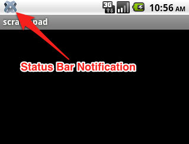
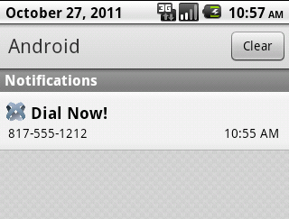

# Android UI Components and Conventions

## Objective

In this section, you will examine some of the user interface and user experience components that are specific to Android. In addition, we'll see how these can be leveraged in a cross platform manner via the Titanium API.

## Contents

Android has a number of features that make it distinct from iOS and other mobile platforms. Among these are the hardware buttons, such as the menu and back buttons, and "toast" notifications. Users expect apps to take advantage of these components and to be used in their conventional ways. Let's look at each of these to see how you can use them in your Titanium apps.

### Android Action Bar

The Android Action Bar is a reserved portion of the window used for branding, navigation controls and application-wide actions.

For details on using the action bar, see [Android Action Bar](/guide/Titanium_SDK/Titanium_SDK_How-tos/User_Interface_Deep_Dives/Android_UI_Components_and_Conventions/Android_Action_Bar/).

### Android menus

Android devices have a hardware or software button that is used to display a menu of options. In native Android, every [Activity](http://developer.android.com/reference/android/app/Activity.html) can have an associated menu. In Titanium, every ["heavyweight" window](/guide/Titanium_SDK/Titanium_SDK_How-tos/Cross-Platform_Mobile_Development_In_Titanium/Android_Platform_Overview/#Heavyweightandlightweightwindows) can have its own menu, as all heavyweight windows having a corresponding Android Activity. Because of the menu's association with the underlying Activity, it is created in a special Android-specific Activity event called `onCreateOptionsMenu`. Below we see how a basic Android menu is declared using Titanium.

```javascript
// Associated directly with an activity
activity = Ti.Android.currentActivity;
activity.onCreateOptionsMenu = function(e) {
    var menu = e.menu;
    var menuItem = menu.add({ title: "Item 1" });
    menuItem.setIcon("item1.png");
    menuItem.addEventListener("click", function(e) {
        // do something when the menu item is tapped
    });
};

// or with your heavyweight window, set here with navBarHidden
var win = Titanium.UI.createWindow({
  navBarHidden: false,
  activity: {
    onCreateOptionsMenu: function(e) {
      var menu = e.menu;
      var menuItem = menu.add({ title: 'Item 1' });
      menuItem.setIcon("item1.png");
      menuItem.addEventListener('click', function(e) {
        // do something when the menu item is tapped
      });
    }
  }
```

If you're writing a cross-platform app, you would want to wrap the first of the above code-snippets in platform-detection code. iOS knows nothing of activities and could throw an error. The second of the above examples will run just fine on iOS. iOS will ignore the `activity` property of the window (actually, it would create a custom property for the object and set it to `null`).

On Android 3.0 and later, menu items can appear on the action bar. See [Android Action Bar](/guide/Titanium_SDK/Titanium_SDK_How-tos/User_Interface_Deep_Dives/Android_UI_Components_and_Conventions/Android_Action_Bar/) for details.

### Android back button

As with the Menu button, the Android Back button is associated with Activities or heavyweight windows. Users expect when they tap the Back button, that they'll "page back" through the stack of open windows. In addition, users will often use the Back button to exit or pause your app. For this reason, you may find it beneficial to handle presses of the Back button to clean up your app and the resources it may be utilizing.

```javascript
// must be a heavyweight window to capture the androidback event
// so set something like fullscreen:false
var win = Ti.UI.createWindow({
  title: 'Hello world',
  backgroundColor: '#fff',
  fullscreen: false
});
win.addEventListener('androidback',function() {
  // do something
});
```

### Android Labels

Titanium Labels have the ability to use inline HTML, as well as embedded links, on Android. You can include simple formatting HTML within a label and Android will render it properly. To do so, you use the `html` property rather than the `text` property. This is pretty handy for cross-platform apps so that you can provide platform-specific label text.

```javascript
var label = Ti.UI.createLabel({
  html: 'Testing <b>bold</b> <i>italic</i> text',
  text: 'This is for iOS',
  top: 125,
  height: 50,
  width: '100%'
});
```

Android also will "linkify" text within your labels. Given the following, the user could tap on the email address to open their mail client; tap the phone number to open the dialer; tap the URL to open their browser; or tap the address to open Maps.

```javascript
var lbl = Ti.UI.createLabel({
  autoLink: Ti.UI.AUTOLINK_ALL, // Prior to SDK 3.0, Ti.UI.Android.LINKIFY_ALL
  left: 5, top: 5, right: 5, height: 100,
  backgroundColor: '#222',
  text: 'Contact\n test@test.com\n 817-555-5555\n http://bit.ly\n 440 Bernardo Ave, Mountain View, CA'
});
```

The linkification options include:

* `Ti.UI.AUTOLINK_ALL (Ti.UI.Android.LINKIFY_ALL)` – linkify all possible forms of links

* `Ti.UI.AUTOLINK_EMAIL_ADDRESSES (Ti.UI.Android.LINKIFY_EMAIL_ADDRESSES)` – linkify just email addresses

* `Ti.UI.AUTOLINK_MAP_ADDRESSES (Ti.UI.Android.LINKIFY_MAP_ADDRESSES)` – linkify just map addresses

* `Ti.UI.AUTOLINK_PHONE_NUMBERS` (`Ti.UI.Android.LINKIFY_PHONE_NUMBERS`) – linkify just phone numbers

* `Ti.UI.AUTOLINK_URLS` (`Ti.UI.Android.LINKIFY_WEB_URLS`) – linkify just Web addresses

The constants shown in parenthesis are the constants used prior to SDK 3.0. The constants listed first should be used in SDK 3.0 and later.

### Toast notifications

Android enables simple "toast" style notifications. These are short messages that briefly float over all other content in your app, disappearing a short time later. You can create such notifications in Titanium by using the `Ti.UI.createNotification() method` as shown here:

```javascript
var n = Ti.UI.createNotification({message:"Howdy folks"});
n.duration = Ti.UI.NOTIFICATION_DURATION_LONG;
// Also valid is NOTIFICATION_DURATION_SHORT

// Optionally, set the X & Y Offsets, by default
n.offsetX = 100;
n.offsetY = 75;
// display the toast message
n.show();
```


### Status bar notifications

The Android status bar provides a central location for application and system notifications. Titanium enables you to post messages to the Status bar (sometimes referred to as the Notification bar) via the `Titanium.Android.Notification` module. To do so, you'll need to explore the Android-specific world of Intents, PendingIntents, and Activities. We won't go deep into those concepts in this guide, but here's a taste of what can be done:

```javascript
// Need an Intent to define what will happen when user taps the notification message
// In this case, it will open the Dialer ready to dial a fictitious number
var intent = Ti.Android.createIntent({
  action: Ti.Android.ACTION_DIAL,
    data: "tel:8175551212"
});
// Create a PendingIntent to tie together the Activity and Intent
var pending = Titanium.Android.createPendingIntent({
    activity: Titanium.Android.currentActivity,
    intent: intent,
    type: Titanium.Android.PENDING_INTENT_FOR_ACTIVITY,
    flags: Titanium.Android.FLAG_UPDATE_CURRENT
});
// Here's the notification now
var notification = Titanium.Android.createNotification({
        icon: 0x7f020000,
        contentTitle: 'Dial Now!',
    contentText: '817-555-1212',
        contentIntent: pending
});
// Send the Notification to the manager, the digit is an ID you could use to later cancel the notification
Titanium.Android.NotificationManager.notify(1, notification);
```

 

### Nine-patch images

A nine-patch image is a PNG image with regions specified as stretchable or not stretchable. For example, if you have an image with a logo centered against a solid background, you can create a nine-patch image with the area around the logo as stretchable. If the image needs to be stretched for a larger device, the solid background color will be stretched, leaving the logo untouched. Nine-patch images are a good solution to support Android devices with different screen sizes and densities.

To create a nine-patch image, you can either use the Android NDK draw9patch tool or a graphics editor. If you are using a graphics editor, create a one-pixel transparent or white border around your PNG image, then change the top and left border to black pixels where you want the image to stretch. You can optionally change the right and bottom border to black pixels to indicate extra padding areas. For more information, refer to the [Android Draw 9-Patch help tutorial](http://developer.android.com/tools/help/draw9patch.html) for directions on using the draw9patch tool or refer to the [Android nine-patch image specification](http://developer.android.com/guide/topics/graphics/2d-graphics.html#nine-patch) for information on creating a nine-patch image in a graphics editor.

Name the file with the extension `.9.png`, for example, `Resources/images/myimage.9.png`.

To use a nine-patch image, reference the image in your code like you would a regular image without the `.9` part of the extension, for example:

```javascript
var button = Ti.UI.createButton({
    backgroundImage: '/images/myimage.png'
});
```

Nine-patch images only work as background images. For example, you can use a nine-patch image to set an ImageView's `backgroundImage` property but not the `image` property.

The project should be cleaned to ensure that the files are correctly copied to the project.

## Hands-on practice

### Goal

In this activity, you will manage the hardware Back button so that the first time it's tapped, a full-screen view will be closed and after that your app will be closed.

### Steps

1. Create a new Titanium SDK project.

2. Delete the contents of app.js and create a new one to these specifications:

    * It should contain a single, heavyweight window, which should have a red background. Set the `exitOnClose:true` property on that window.

    * The window should contain a label with the text "Tap the Android Back button to close the app". Set that label's font color to black so that it's visible.

    * The window should contain a view that fills 90% of the window. The view should have a white background.

    * The view should contain a label with the text "Tap the Android Back button to close this white view and show the underlying red window". Set that label's font color to black so that it's visible.

3. Write a function that when called will hide the view and remove the `androidback` event listener from the window.

4. Add an event listener to the window so that when the `androidback` event fires, your custom function is called.

5. Make sure to add the labels to the window and view, and add the view to the window. Make sure to open the window at the end of your code.

6. Build the app for the Android emulator or for a device.

7. With the white view showing, tap the Back button. The view should close. Tap Back again and the app should close.

## Summary

In this section, you learned the basics of Android-specific user interface and experience. These features included hardware buttons, flexible labels, and notifications. In the final section of this chapter, we'll explore the platform specific features of iOS.

## References and further reading

* [Finished code](http://assets.appcelerator.com.s3.amazonaws.com/app_u/ebook/3.5_android_UI.zip)

* [Android Platform Overview](/guide/Titanium_SDK/Titanium_SDK_How-tos/Cross-Platform_Mobile_Development_In_Titanium/Android_Platform_Overview/)

* [Android developer docs: User interface](http://developer.android.com/guide/topics/ui/index.html)
